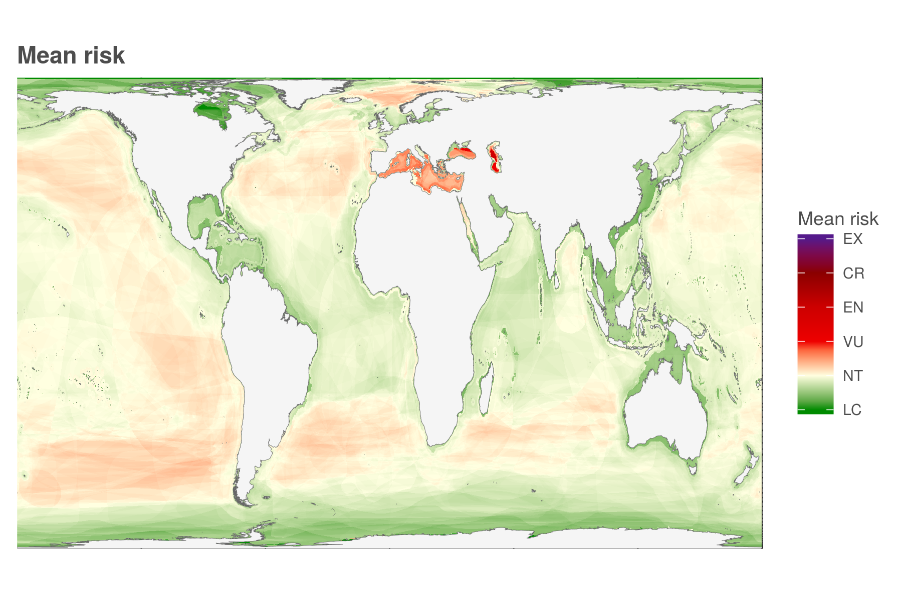
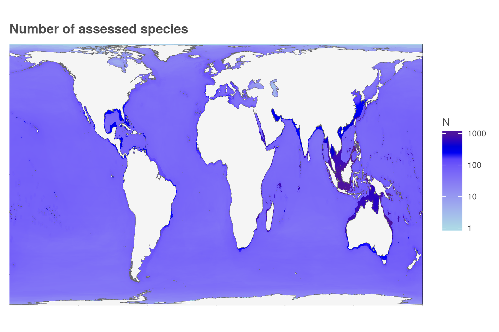
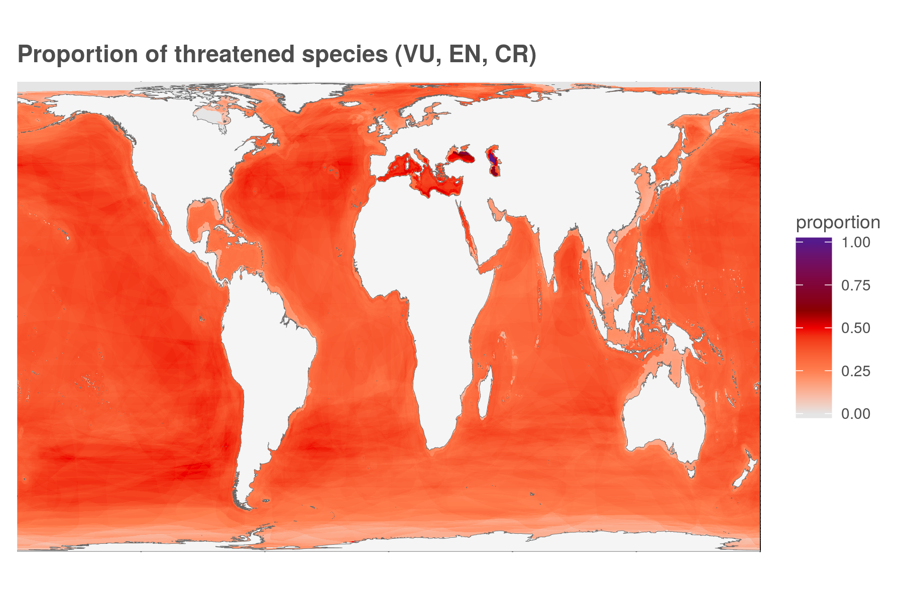
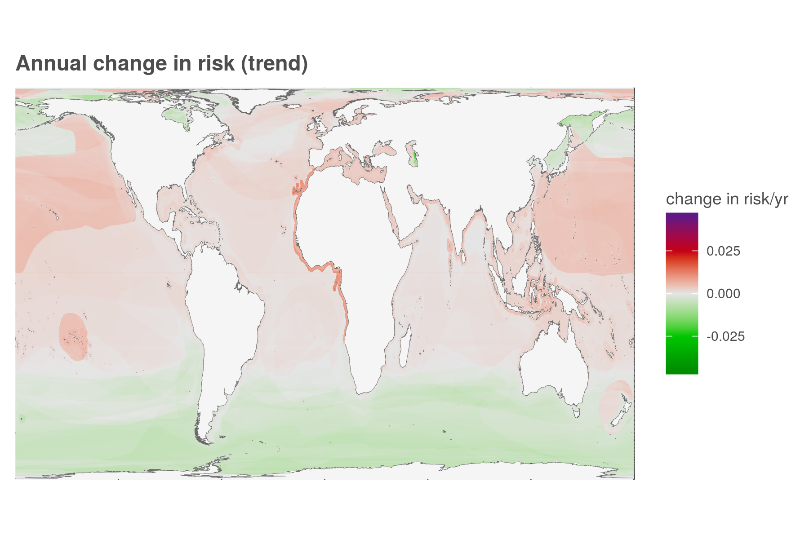

``` {r setup, echo = TRUE, message = FALSE, warning = FALSE}

knitr::opts_chunk$set(fig.width = 6, fig.height = 4, fig.path = 'figs/',
                      echo = TRUE, message = FALSE, warning = FALSE)

library(raster)
library(data.table)
library(sf)


source('https://raw.githubusercontent.com/oharac/src/master/R/common.R')  ###
  ### includes library(tidyverse); library(stringr); dir_M points to ohi directory

dir_git <- '~/github/spp_risk_dists'

### goal specific folders and info
dir_setup <- file.path(dir_git, 'data_setup')
dir_data  <- file.path(dir_git, 'data')
dir_o_anx <- file.path(dir_O, 'git-annex/spp_risk_dists')

source(file.path(dir_git, 'data_setup/api_fxns.R'))

### Gall-Peters doesn't have an EPSG?
gp_proj4 <- '+proj=cea +lon_0=0 +lat_ts=45 +x_0=0 +y_0=0 +ellps=WGS84 +units=m +no_defs'

```

# Summary

Create a set of maps of the distribution of biodiversity intactness - all species assessed and mapped by IUCN.  These maps are generated at 10 km^2^ resolution in a Gall-Peters projection.  These maps will be generated using all available species:

* Mean risk
* Variance of risk
* Number of species for mean/var calculations
* Number of species categorized as "threatened" (i.e. VU, EN, CR)
* Mean trend
* Number of species for trend calculations
    
A selection of these maps will be generated for taxonomic groups and range sizes in a separate Rmd.

Future iterations may include:

* Range-rarity-weighted mean and variance of risk
* Range rarity-weighted species richness

# Data Sources

IUCN Red List spatial data download
IUCN Red List API
Gina Ralph (IUCN)

# Methods

## Spatial distribution of current extinction risk

### Aggregate mean risk and variance by cell

In data_setup we have calculated, for each taxonomic group, cell values for mean risk, var risk, n_spp risk, n threatened, mean trend, n_spp trend.  Here we bring those data frames all together to calculate these values across all assessed species.

Note: reconstructing the total mean per cell from the group means is straightforward:
$$\bar x_T = \frac{1}{\sum_{g=1}^G n_g} \sum_{g=1}^G (n_g \bar x_g)$$
but reconstructing the variance is more complex.  Here is the derivation starting from sample variance of the total data set:
\begin{align*}
  s_T^2 &= \frac{1}{n_T - 1} \sum_{i=1}^{n_T}(x_i - \bar x_T)^2\\
    &= \frac{1}{n_T - 1} \left( \sum_{i=1}^{n_T} x_i^2 -  
        2 \sum_{i=1}^{n_T} x_i \bar x_T +  
        \sum_{i=1}^{n_T} \bar x_T^2 \right)\\
    &= \frac{1}{n_T - 1} \left( \sum_{i=1}^{n_T} x_i^2 - n_T \bar x_T^2 \right)\\
  \Longrightarrow \hspace{5pt} (n_T - 1) s_T^2 + n_T \bar x_T^2 &= \sum_{i=1}^{n_T} x_i^2
        &\text{(identity 1)}\\
  (n_T - 1) s_T^2 + n_T \bar x_T^2 &= \sum_{i=1}^{n_T} x_i^2 =
        \sum_{j=1}^{n_{gp1}} x_j^2 + \sum_{k=1}^{n_{gp2}} x_k^2 + ...
        &\text{(decompose into groups)}\\
    &= (n_{gp1} - 1) s_{gp1}^2 + n_{gp1} \bar x_{gp1}^2 + (n_{gp2} - 1) s_{gp2}^2 + n_{gp2} \bar x_{gp2}^2 + ...
        &\text{(sub in identity 1)}\\
    &= \sum_{gp = 1}^{Gp} \left((n_{gp} - 1) s_{gp}^2 + n_{gp} \bar x_{gp}^2 \right)\\
  \Longrightarrow s_T^2 &= \frac{1}{n_T - 1} 
        \sum_{gp = 1}^{Gp} \left[(n_{gp} - 1) s_{gp}^2 + 
               n_{gp} \bar x_{gp}^2 \right] - \frac{ n_T}{n_T - 1} \bar x_T^2 
\end{align*}
Because of file sizes, the intermediate files will be stored outside of GitHub.

``` {r create_cell_value_df_for_all_spp}

cell_summary_file <- file.path(dir_o_anx, 'cell_summary_unweighted_gp.csv')
### unlink(cell_summary_file)
reload <- FALSE

if(!file.exists(cell_summary_file) | reload == TRUE) {
  dir_taxa_summaries <- file.path(dir_o_anx, 'taxa_summaries')
  sum_files <- list.files(dir_taxa_summaries,
                          pattern = sprintf('cell_sum_%s_gp.csv', api_version),
                          full.names = TRUE)
  
  message('going into the first mclapply...')
  
  ptm <- system.time({
    cell_values_all <- parallel::mclapply(sum_files, mc.cores = 32,
                                          FUN = function(x) {
                                            read_csv(x, col_types = 'dddiidi')
                                            }) %>%
      bind_rows()
  }) ### end of system.time
  message('... processing time ', ptm[3], ' sec')
    
  ### chunk into smaller bits for mclapply usage in the summarizing step.  Use mclapply to chunk,
  ### then pass result to mclapply to calculate weighted average values
  chunksize  <- 10000
  cell_ids  <- cell_values_all$cell_id %>% unique() %>% sort()
  n_chunks <- ceiling(length(cell_ids) / chunksize)
  
  message('going into the second mclapply...')
  # system.time({ 
    ### standard:  3 sec for 5, 12.5 sec for 20... 32 sec for 50... 479 chunks ~ 6 min.
    ### mclapply: 4 sec for 50, with 32 cores. 52 sec for the whole shebang.
  ptm <- system.time({
    cell_vals_list <- parallel::mclapply(1:n_chunks, mc.cores = 12,
        FUN = function(x) { ### x <- 1
          btm_i <- (x - 1) * chunksize + 1
          top_i <- min(x * chunksize, length(cell_ids))
          ids <- cell_ids[btm_i:top_i]
          
          df <- cell_values_all %>%
           filter(cell_id %in% ids)
        }) ### end of mclapply
  }) ### end of system.time
  message('... processing time ', ptm[3], ' sec')
  
  message('going into the third mclapply...')
  
  ptm <- system.time({
    cell_summary_list <- parallel::mclapply(cell_vals_list, mc.cores = 24,
                                       FUN = function(x) {
      ### x <- cell_vals_list[[250]]
      y <- x %>%
        group_by(cell_id) %>%
        summarize(mean_risk   = sum(mean_risk * n_spp_risk) / sum(n_spp_risk),
                  n_spp_risk  = sum(n_spp_risk), ### n_total
                  n_spp_threatened = sum(n_spp_threatened, na.rm = TRUE),
                  pct_threatened   = n_spp_threatened / n_spp_risk,
                  mean_trend  = sum(mean_trend * n_spp_trend, na.rm = TRUE) / sum(n_spp_trend, na.rm = TRUE),
                  n_spp_trend = sum(n_spp_trend, na.rm = TRUE))
      
      z <- x %>%
        mutate(mean_risk_g = mean_risk,   ### protect it
               n_spp_risk_g = n_spp_risk, ### protect it
               var_risk_g  = ifelse(var_risk < 0 | is.na(var_risk) | is.infinite(var_risk), 
                                    0, var_risk)) %>%
        ### any non-valid variances probably due to only one observation, which
        ### results in corrected var of infinity... set to zero and proceed!
        group_by(cell_id) %>%
        summarize(mean_risk_t = sum(mean_risk_g * n_spp_risk_g) / sum(n_spp_risk_g),
                  n_spp_risk_t  = sum(n_spp_risk_g), ### n_total
                  var_risk    = 1 / (n_spp_risk_t - 1) *
                    (sum(var_risk_g * (n_spp_risk_g - 1) + n_spp_risk_g * mean_risk_g^2) -
                         n_spp_risk_t * mean_risk_t^2),
                  var_risk = ifelse(var_risk < 0, 0, var_risk),
                  var_risk = ifelse(is.nan(var_risk) | is.infinite(var_risk), NA, var_risk)) %>%
                    ### get rid of negative (tiny) variances and infinite variances
        select(cell_id, var_risk)
      
        yz <- left_join(y, z, by = 'cell_id')
        return(yz)
      }) ### end of mclapply
  }) ### end of system.time
  message('... processing time ', ptm[3], ' sec')
  message('done!')
  
  cell_summary <- cell_summary_list %>%
    bind_rows()
  
  write_csv(cell_summary, cell_summary_file)
  
} else {
  
  message('Reading existing cell summary file: ', cell_summary_file)
  cell_summary <- read_csv(cell_summary_file, col_types = 'ddiiddid')

}

```

### And now, the maps

``` {r mean_risk_raster}

reload <- FALSE

rast_base <- raster(file.path(dir_git, 'spatial', 'cell_id_rast_gp.tif'))

land_poly <- sf::read_sf(file.path(dir_git, 'spatial/ne_10m_land/ne_10m_land.shp')) %>%
  st_transform(gp_proj4)


map_plot_file <- file.path(dir_git, 'ms_figures/fig1_map_mean_risk_gp.png')

if(!file.exists(map_plot_file) | reload == TRUE) {
    
  
  mean_rast <- subs(rast_base, cell_summary, by = 'cell_id', which = 'mean_risk')
  writeRaster(mean_rast, file.path(dir_git, 'output', 'mean_risk_raster_gp.tif'),
              overwrite = TRUE)
  
  ### mean_rast <- raster(file.path(dir_git, 'output', 'mean_risk_raster_gp.tif'))
  
  mean_df <- mean_rast %>% 
    # aggregate(fact = 4) %>%
    rasterToPoints() %>% 
    as.data.frame() %>%
    setNames(c('long', 'lat', 'value'))
  
  message('ggplotting the global map...')
  
  x <- ggplot(mean_df) +
    geom_raster(aes(long, lat, fill = value)) +
    geom_sf(data = land_poly, aes(geometry = geometry), fill = 'grey96', color = 'grey40', size = .10) +
    ggtheme_map() +
    scale_fill_gradientn(colors = c('green4', 'lightyellow', 'red2', 'red3', 'red4', 'purple4'),
                         limits = c(0, 1),
                         labels = c('LC', 'NT', 'VU', 'EN', 'CR', 'EX'),
                         breaks = c( 0.0,  0.2,  0.4,  0.6,  0.8,  1.0)) +
    scale_x_continuous(expand = c(0, 0)) +
    scale_y_continuous(expand = c(0, 0)) +
    labs(title = 'Mean risk',
         fill  = 'Mean risk')
  
  ggsave(filename = map_plot_file, width = 6, height = 4, units = 'in', dpi = 300)
  
  # message('now ggplotting the regional maps...')
  # 
  # x <- ggplot(mean_df) +
  #   geom_raster(aes(long, lat, fill = value)) +
  #   geom_sf(data = land_poly, aes(geometry = geometry), fill = 'grey96', color = 'grey40', size = .10) +
  #   ggtheme_map() +
  #   scale_fill_gradientn(colors = c('green4', 'lightyellow', 'red2', 'red3', 'red4', 'purple4'),
  #                        limits = c(0, 1),
  #                        labels = c('LC', 'NT', 'VU', 'EN', 'CR', 'EX'),
  #                        breaks = c( 0.0,  0.2,  0.4,  0.6,  0.8,  1.0)) +
  #   coord_sf(xlim = c(-180, -110),  ylim = c(30, 63)) +
  #   scale_x_continuous(expand = c(0, 0)) +
  #   scale_y_continuous(expand = c(0, 0)) +
  #   labs(title = 'Mean risk (NE Pacific)',
  #        fill  = 'Mean risk')
  # 
  # ggsave(filename = str_replace(map_plot_file, '.png', '_ne_pac.png') %>% 
  #          str_replace('fig1', 'fig_SI'),
  #        width = 6, height = 4, units = 'in', dpi = 300)
  # 
  # x <- ggplot(mean_df) +
  #   geom_raster(aes(long, lat, fill = value)) +
  #   geom_sf(data = land_poly, aes(geometry = geometry), fill = 'grey96', color = 'grey40', size = .10) +
  #   ggtheme_map() +
  #   scale_fill_gradientn(colors = c('green4', 'lightyellow', 'red2', 'red3', 'red4', 'purple4'),
  #                        limits = c(0, 1),
  #                        labels = c('LC', 'NT', 'VU', 'EN', 'CR', 'EX'),
  #                        breaks = c( 0.0,  0.2,  0.4,  0.6,  0.8,  1.0)) +
  #   coord_sf(xlim = c(-20, 45), ylim = c(28, 48)) +
  #   scale_x_continuous(expand = c(0, 0)) +
  #   scale_y_continuous(expand = c(0, 0)) +
  #   labs(title = 'Mean risk (Mediterranean)',
  #        fill  = 'Mean risk')
  # 
  # ggsave(filename = str_replace(map_plot_file, '.png', '_med.png') %>% 
  #          str_replace('fig1', 'fig_SI'),
  #        width = 6, height = 4, units = 'in', dpi = 300)
  #   
  # x <- ggplot(mean_df) +
  #   geom_raster(aes(long, lat, fill = value)) +
  #   geom_sf(data = land_poly, aes(geometry = geometry), fill = 'grey96', color = 'grey40', size = .10) +
  #   ggtheme_map() +
  #   scale_fill_gradientn(colors = c('green4', 'lightyellow', 'red2', 'red3', 'red4', 'purple4'),
  #                        limits = c(0, 1),
  #                        labels = c('LC', 'NT', 'VU', 'EN', 'CR', 'EX'),
  #                        breaks = c( 0.0,  0.2,  0.4,  0.6,  0.8,  1.0)) +
  #   coord_sf(xlim = c(-100, 15), ylim = c(-10, 33)) +
  #   scale_x_continuous(expand = c(0, 0)) +
  #   scale_y_continuous(expand = c(0, 0)) +
  #   labs(title = 'Mean risk (mid-Atlantic)',
  #        fill  = 'Mean risk')
  # 
  # ggsave(filename = str_replace(map_plot_file, '.png', '_mid_atl.png') %>% 
  #          str_replace('fig1', 'fig_SI'),
  #        width = 6, height = 4, units = 'in', dpi = 300)
  # 
  # 
  # x <- ggplot(mean_df) +
  #   geom_raster(aes(long, lat, fill = value)) +
  #   geom_sf(data = land_poly, aes(geometry = geometry), fill = 'grey96', color = 'grey40', size = .10) +
  #   ggtheme_map() +
  #   scale_fill_gradientn(colors = c('green4', 'lightyellow', 'red2', 'red3', 'red4', 'purple4'),
  #                        limits = c(0, 1),
  #                        labels = c('LC', 'NT', 'VU', 'EN', 'CR', 'EX'),
  #                        breaks = c( 0.0,  0.2,  0.4,  0.6,  0.8,  1.0)) +
  #   coord_sf(xlim = c(75, 150), ylim = c(-30, 30)) +
  #   scale_x_continuous(expand = c(0, 0)) +
  #   scale_y_continuous(expand = c(0, 0)) +
  #   labs(title = 'Mean risk (Coral Triangle)',
  #        fill  = 'Mean risk')
  # ggsave(filename = str_replace(map_plot_file, '.png', '_se_asia.png') %>% 
  #          str_replace('fig1', 'fig_SI'),
  #        width = 6, height = 4, units = 'in', dpi = 300)
  # 
  # 
} else {
  message('Map exists: ', map_plot_file)
}

```


<!--  -->
<!--  -->
<!--  -->
<!--  -->

``` {r var_risk_raster}

map_plot_file <- file.path(dir_git, 'ms_figures/fig_SI_map_var_risk_gp.png')

if(!file.exists(map_plot_file) | reload == TRUE) {

  var_rast <- subs(rast_base, cell_summary, by = 'cell_id', which = 'var_risk')
  writeRaster(var_rast, file.path(dir_git, 'output', 'var_risk_raster_gp.tif'),
              overwrite = TRUE)
  
  var_df <- var_rast %>% 
    # aggregate(fact = 4) %>%
    rasterToPoints() %>% 
    as.data.frame() %>%
    setNames(c('long', 'lat', 'value'))
  
  x <- ggplot(var_df) +
    geom_raster(aes(long, lat, fill = value)) +
    geom_sf(data = land_poly, aes(geometry = geometry), fill = 'grey96', color = 'grey40', size = .10) +
    ggtheme_map() +
    scale_fill_gradientn(colors = c('green3', 'lightyellow', 'red3', 'purple4'),
                         values = c(0, .25, .5, 1)) +
    scale_x_continuous(expand = c(0, 0)) +
    scale_y_continuous(expand = c(0, 0)) +
    labs(title = 'Variance of risk',
         fill  = 'Var of risk')

  ggsave(filename = map_plot_file,
         width = 6, height = 4, units = 'in', dpi = 300)

} else {
  message('Map exists: ', map_plot_file)
}

```


``` {r n_spp_risk}

map_plot_file <- file.path(dir_git, 'ms_figures/fig_SI_map_n_risk_gp.png')

if(!file.exists(map_plot_file) | reload == TRUE) {

  n_spp_rast <- subs(rast_base, cell_summary, by = 'cell_id', which = 'n_spp_risk')
  writeRaster(n_spp_rast, file.path(dir_git, 'output', 'n_spp_risk_raster_gp.tif'),
              overwrite = TRUE)
  
  n_spp_df <- n_spp_rast %>% 
    # aggregate(fact = 4) %>%
    rasterToPoints() %>% 
    as.data.frame() %>%
    setNames(c('long', 'lat', 'value')) %>%
    mutate(log_value = log10(value))
  
  x <- ggplot(n_spp_df) +
    geom_raster(aes(long, lat, fill = log_value)) +
    geom_sf(data = land_poly, aes(geometry = geometry), fill = 'grey96', color = 'grey40', size = .10) +
    ggtheme_map() +
    scale_fill_gradientn(colors = c('lightblue', 'blue1', 'blue3', 'purple4'),
                         values = c(0, .7, .8, .9, 1),
                         breaks = c(0,  1,   2,    3),
                         labels = c(1, 10, 100, 1000)) +
    scale_x_continuous(expand = c(0, 0)) +
    scale_y_continuous(expand = c(0, 0)) +
    labs(title = 'Number of assessed species',
         fill = 'N')

  ggsave(filename = map_plot_file,
         width = 6, height = 4, units = 'in', dpi = 300)

} else {
  message('Map exists: ', map_plot_file)
}
```



``` {r n_spp_threatened}

map_plot_file <- file.path(dir_git, 'ms_figures/fig2_map_pct_threatened_gp.png')

if(!file.exists(map_plot_file) | reload == TRUE) {

  n_threat_rast <- subs(rast_base, cell_summary, by = 'cell_id', which = 'n_spp_threatened')
  writeRaster(n_threat_rast, file.path(dir_git, 'output', 'n_threat_raster_gp.tif'),
              overwrite = TRUE)
  ### n_threat_rast <- raster(file.path(dir_git, 'output', 'n_threat_raster_gp.tif'))
  # n_threat_df <- n_threat_rast %>% 
  #   # aggregate(fact = 4) %>%
  #   rasterToPoints() %>% 
  #   as.data.frame() %>%
  #   setNames(c('long', 'lat', 'value')) %>%
  #   mutate(log_value = log(value))
  
  
  # x <- ggplot(n_threat_df) +
  #   geom_raster(aes(long, lat, fill = value)) +
  #   geom_sf(data = land_poly, aes(geometry = geometry), fill = 'grey96', color = 'grey40', size = .10) +
  #   ggtheme_map() +
  #   scale_fill_gradientn(colors = c('grey90', 'coral', 'red1', 'red3', 'red4', 'purple4'),
  #                        values = c(0, .5, .7, .8, .9, 1)) +
  #   scale_x_continuous(expand = c(0, 0)) +
  #   scale_y_continuous(expand = c(0, 0)) +
  #   labs(title = 'Number of threatened species (VU, EN, CR) (ln transformed)',
  #        fill  = 'ln N')
  # 
  
  pct_threat_rast <- subs(rast_base, cell_summary, by = 'cell_id', which = 'pct_threatened')
  writeRaster(pct_threat_rast, file.path(dir_git, 'output', 'pct_threat_raster_gp.tif'),
              overwrite = TRUE)
  ### n_threat_rast <- raster(file.path(dir_git, 'output', 'n_threat_raster_gp.tif'))
  pct_threat_df <- pct_threat_rast %>% 
    # aggregate(fact = 4) %>%
    rasterToPoints() %>% 
    as.data.frame() %>%
    setNames(c('long', 'lat', 'value'))
  
  
  x <- ggplot(pct_threat_df) +
    geom_raster(aes(long, lat, fill = value)) +
    geom_sf(data = land_poly, aes(geometry = geometry), fill = 'grey96', color = 'grey40', size = .10) +
    ggtheme_map() +
    scale_fill_gradientn(colors = c('grey90', 'coral', 'red2', 'red4', 'purple4'),
                         limits = c(0, 1),
                         values = c(0, .25, .5, .6, 1)) +
    coord_sf() +
    scale_x_continuous(expand = c(0, 0)) +
    scale_y_continuous(expand = c(0, 0)) +
    labs(title = 'Proportion of threatened species (VU, EN, CR)',
         fill  = 'proportion')
  
  ggsave(filename = map_plot_file,
         width = 6, height = 4, units = 'in', dpi = 300)

  
  x <- ggplot(pct_threat_df, aes(x = value)) +
    ggtheme_plot() +
    geom_density(alpha = .3, size = .25, color = 'red') +
    theme(axis.text.y = element_blank(),
          axis.title.y = element_blank()) +
    labs(title = 'dist of % species in VU, EN, CR')
  
  quantile(pct_threat_df$value, c(0.01, 0.05, seq(0.10, 1.00, 0.10)))

} else {
  message('Map exists: ', map_plot_file)
}

```



``` {r trend}

map_plot_file <- file.path(dir_git, 'ms_figures/fig_SI_map_mean_trend_gp.png')

if(!file.exists(map_plot_file) | reload == TRUE) {

  trend_rast <- subs(rast_base, cell_summary, by = 'cell_id', which = 'mean_trend')
  writeRaster(trend_rast, file.path(dir_git, 'output', 'trend_raster_gp.tif'),
              overwrite = TRUE)
  
  trend_df <- trend_rast %>% 
    # aggregate(fact = 4) %>%
    rasterToPoints() %>% 
    as.data.frame() %>%
    setNames(c('long', 'lat', 'value'))
  
  trend_max <- abs(range(trend_df$value)) %>% max()
  
  x <- ggplot(trend_df) +
    geom_raster(aes(long, lat, fill = value)) +
    geom_sf(data = land_poly, aes(geometry = geometry), fill = 'grey96', color = 'grey40', size = .10) +
    ggtheme_map() +
    scale_fill_gradientn(colors = c('green4', 'green3', 'grey90', 'red3', 'purple4'),
                         values = c(0, .25, .5, .75, 1),
                         limits = c(-trend_max, trend_max)) +
    scale_x_continuous(expand = c(0, 0)) +
    scale_y_continuous(expand = c(0, 0)) +
    labs(title = 'Annual change in risk (trend)',
         fill  = 'change in risk/yr')

  ggsave(filename = map_plot_file,
         width = 6, height = 4, units = 'in', dpi = 300)

} else {
  message('Map exists: ', map_plot_file)
}

```



``` {r n_trend}

map_plot_file <- file.path(dir_git, 'ms_figures/fig_SI_map_n_trend_gp.png')

if(!file.exists(map_plot_file) | reload == TRUE) {

  n_trend_rast <- subs(rast_base, cell_summary, by = 'cell_id', which = 'n_spp_trend')
  writeRaster(n_trend_rast, file.path(dir_git, 'output', 'n_trend_raster_gp.tif'),
              overwrite = TRUE)
  
  n_trend_df <- n_trend_rast %>% 
    # aggregate(fact = 4) %>%
    rasterToPoints() %>% 
    as.data.frame() %>%
    setNames(c('long', 'lat', 'value')) %>%
    mutate(log_value = log10(value))
  
  x <- ggplot(n_trend_df) +
    geom_raster(aes(long, lat, fill = log_value)) +
    geom_sf(data = land_poly, aes(geometry = geometry), fill = 'grey96', color = 'grey40', size = .10) +
    ggtheme_map() +
    scale_fill_gradientn(colors = c('lightblue', 'blue1', 'blue3', 'purple4'),
                         values = c(0, .7, .8, .9, 1),
                         breaks = c(0, 1, 2, 3),
                         labels = c(1, 10, 100, 1000)) +
    scale_x_continuous(expand = c(0, 0)) +
    scale_y_continuous(expand = c(0, 0)) +
    labs(title = 'Number of trend-assessed species',
         fill  = 'N')
  
  ggsave(filename = map_plot_file,
         width = 6, height = 4, units = 'in', dpi = 300)

} else {
  message('Map exists: ', map_plot_file)
}
```


