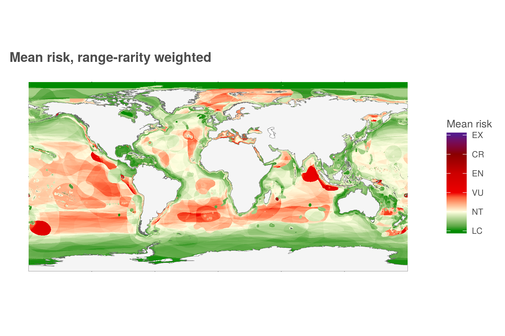
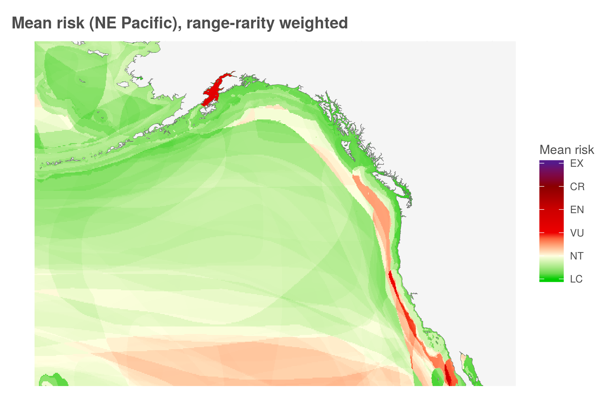
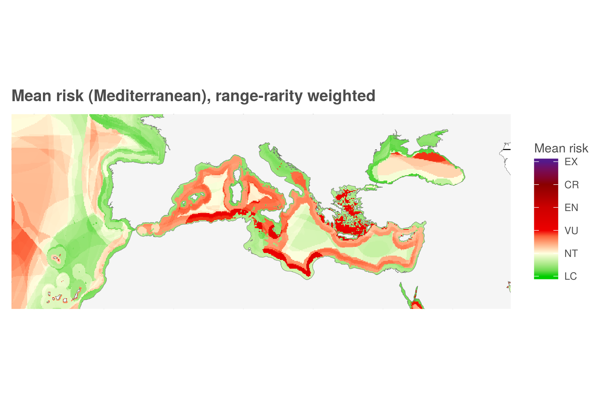
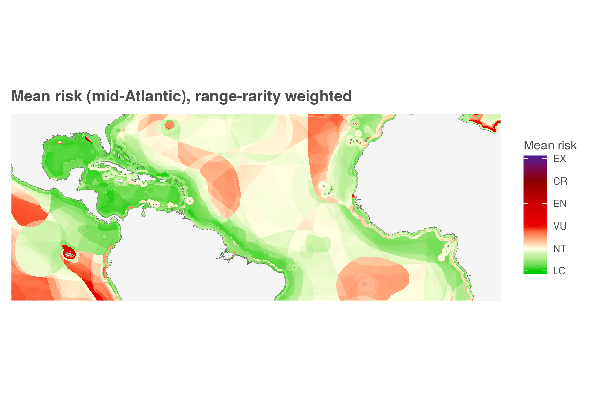
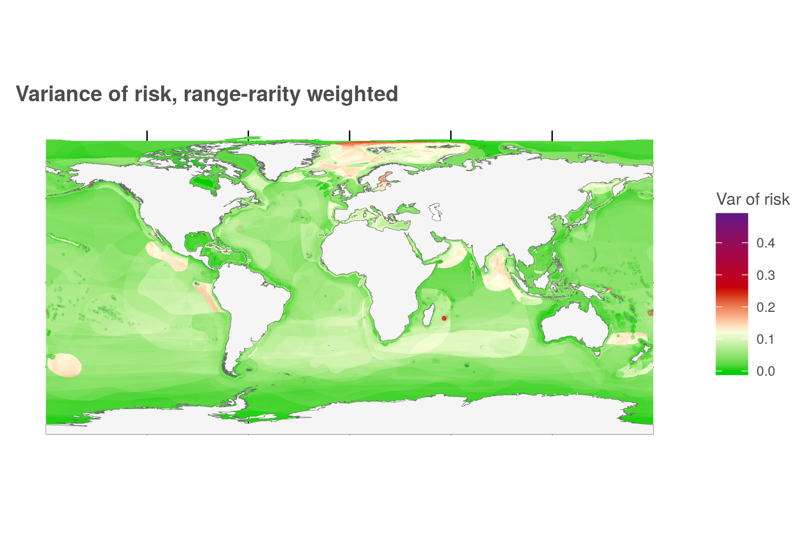
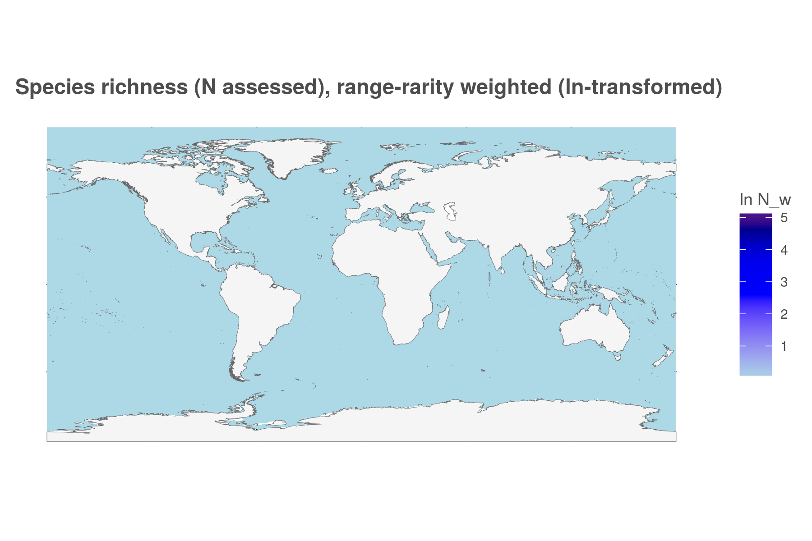
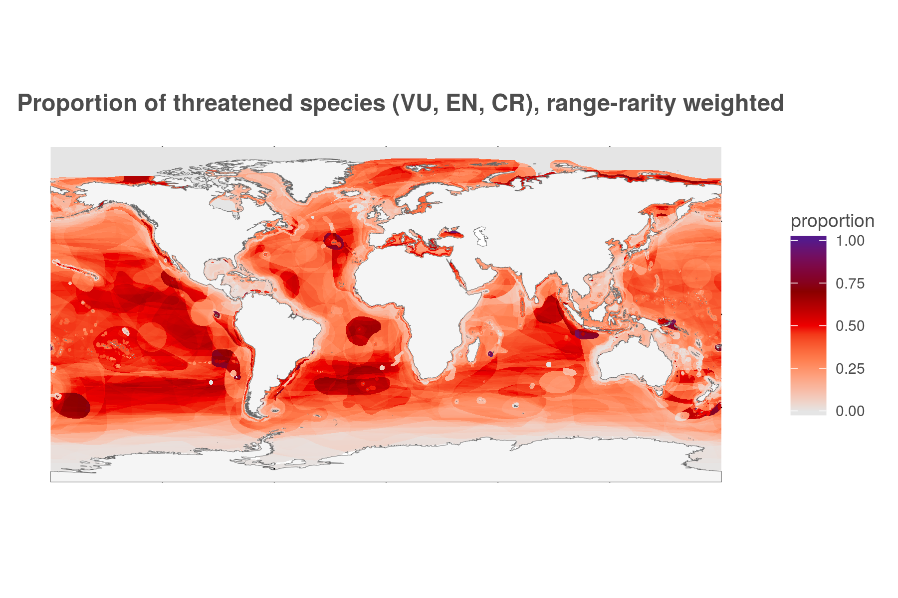
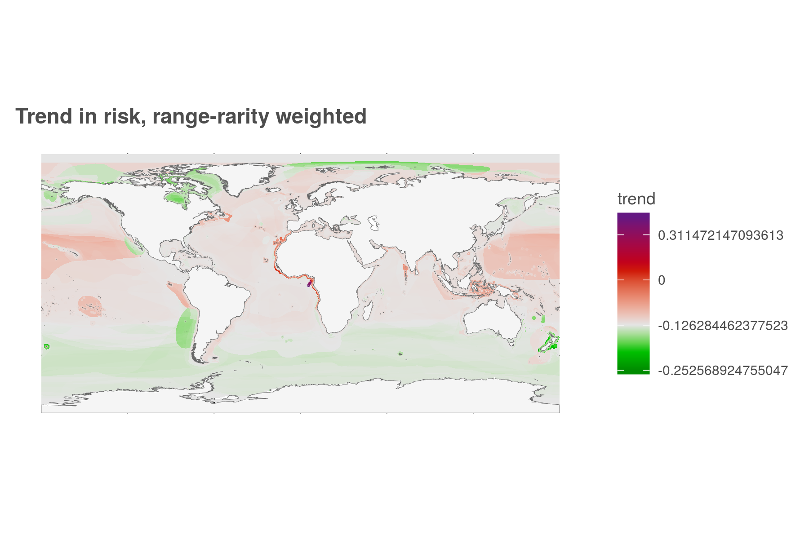
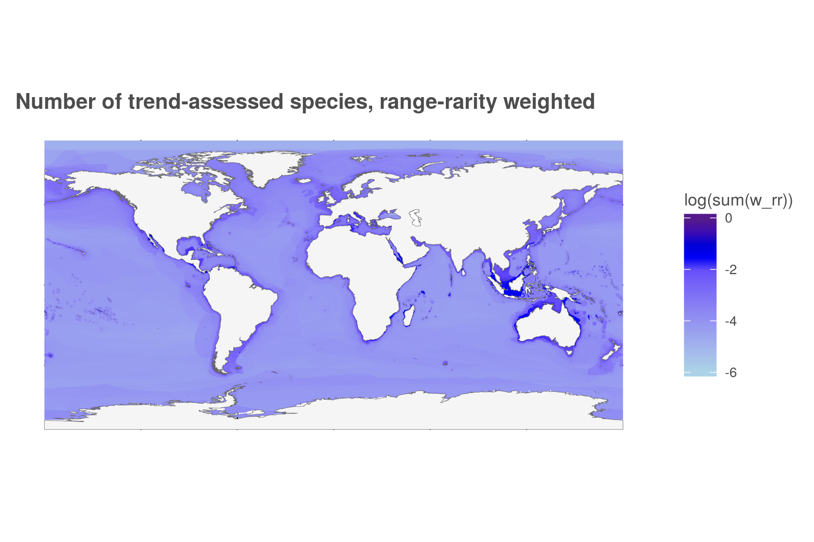

``` {r setup, echo = TRUE, message = FALSE, warning = FALSE}

knitr::opts_chunk$set(fig.width = 6, fig.height = 4, fig.path = 'figs/',
                      echo = TRUE, message = FALSE, warning = FALSE)

library(raster)
library(data.table)


source('https://raw.githubusercontent.com/oharac/src/master/R/common.R')  ###
  ### includes library(tidyverse); library(stringr); dir_M points to ohi directory

dir_git <- '~/github/spp_risk_dists'

### goal specific folders and info
dir_setup <- file.path(dir_git, 'data_setup')
dir_data  <- file.path(dir_git, 'data')
dir_o_anx <- file.path(dir_O, 'git-annex/spp_risk_dists')

source(file.path(dir_git, 'data_setup/api_fxns.R'))

```

# Summary

Create a set of maps of the distribution of biodiversity intactness - all species assessed and mapped by IUCN.  These maps are generated at 0.10° lat/long resolution.  All values are calculated based on range rarity, i.e. a cell's value depends on the status and relative proportion of range of each species present in the cell.  These maps will be generated using all available species:

* Mean risk
* Variance of risk
* Number of species for mean/var calculations
* Number of species categorized as "threatened" (i.e. VU, EN, CR)
* Mean trend
* Number of species for trend calculations
    
A selection of these maps will be generated for taxonomic groups and range sizes in a separate Rmd.

# Data Sources

IUCN Red List spatial data download
IUCN Red List API
Gina Ralph (IUCN)

# Methods

## Spatial distribution of range-rarity-weighted current extinction risk

### Aggregate mean risk and variance by cell

In data_setup we have calculated, for each taxonomic group, cell values for mean risk, var risk, and mean trend, as well as  range-rarity-weighted species richness (sr_rr) for risk, threatened, and trend.  Here we bring those data frames all together to calculate these values across all assessed species.

Note: reconstructing the weighted mean per cell from the group means is straightforward:
$$\bar x_{T,w} = \frac{1}{\sum_{g=1}^G w_g} \sum_{g=1}^G (w_g \bar x_{g,w})$$
but reconstructing the variance is more complex.  Here is the derivation starting from sample variance of the total data set:
\begin{align*}
  s_{w,T}^2 &= \frac{V_{1,T}}{V_{1,T}^2 - V_{2,T}} \sum_{i=1}^{n_T} w_i (x_i - \bar x_{w,T})^2\\
    \text{where } V_{1,T} &= \sum_{i=1}^{n_T}w_i \text{ and } V_{2,T} = \sum_{i=1}^{n_T}w_i^2\\ 
    \text{Let } \gamma &= \frac{V_{1,T}}{V_{1,T}^2 - V_{2,T}}\\
  \Rightarrow  s_{w,T}^2 &= \gamma_T \left( \sum_{i=1}^{n_T} w_i x_i^2 -  
        2 \sum_{i=1}^{n_T} w_i x_i \bar x_{w,T} +  
        \sum_{i=1}^{n_T} w_i \bar x_{w,T}^2 \right)\\
    &= \gamma_T \left( \sum_{i=1}^{n_T} w_i x_i^2 - V_{1,T} \bar x_{w,T}^2 \right)\\
  \Longrightarrow \hspace{5pt} \frac{1}{\gamma_T} s_{w,T}^2 + V_{1,T} \bar x_{w,T}^2 &= \sum_{i=1}^{n_T} w_i x_i^2
        &\text{(identity 1)}\\
  \frac{1}{\gamma_T} s_{w,T}^2 +  V_{1,T}  \bar x_{w,T}^2 &= \sum_{i=1}^{n_T} w_i x_i^2 =
        \sum_{j=1}^{n_{gp1}} w_j x_j^2 + \sum_{k=1}^{n_{gp2}} w_k x_k^2 + ...
        &\text{(decompose into groups)}\\
    &= \frac{1}{\gamma_{gp1}} s_{gp1}^2 + V_{1,gp1} \bar x_{w,gp1}^2 + \frac{1}{\gamma_{gp2}} s_{gp2}^2 + V_{1,gp2} \bar x_{w,gp2}^2 + ...
        &\text{(sub in identity 1)}\\
    &= \sum_{gp = 1}^{Gp} \left(\frac{1}{\gamma_{gp}} s_{gp}^2 + V_{1,gp} \bar x_{w,gp}^2 \right)\\
  \Longrightarrow s_{w,T}^2 &= \gamma_T 
        \sum_{gp = 1}^{Gp} \left[\frac{1}{\gamma_{gp}} s_{gp}^2 + 
               V_{1,gp} \bar x_{w,gp}^2 \right] - \gamma_T V_{1,T} \bar x_{w,T}^2 
\end{align*}
Because of file sizes, the intermediate files will be stored outside of GitHub.

``` {r create_cell_value_df_for_all_spp}

cell_summary_file <- file.path(dir_o_anx, 'cell_summary_rr_weighted.csv')
### unlink(cell_summary_file)
reload <- FALSE

if(!file.exists(cell_summary_file) | reload == TRUE) {

  dir_taxa_summaries <- file.path(dir_o_anx, 'taxa_summaries')
  sum_files <- list.files(dir_taxa_summaries,
                          pattern = sprintf('cell_sum_rrweight_%s.csv', api_version),
                          full.names = TRUE)
  
  ########################################################.
  ###      Read in all files and bind to df          #####
  ########################################################.
  message('going into the first mclapply...')
  
  # check_cols <- parallel::mclapply(sum_files, mc.cores = 25,
  #                                       FUN = function(x) { ### x <- sum_files[2]
  #                                         y <- read_csv(x, n_max = 1)
  #                                         z <- data.frame('sum_file' = x, 'columns' = names(y))
  #                                         }
  #                                       ) %>%
  #   bind_rows() %>%
  #   group_by(sum_file) %>%
  #   mutate(n_cols = n())
  
  ptm <- system.time({
    cell_values_all <- parallel::mclapply(sum_files, mc.cores = 24,
                                          FUN = function(x) { ### x <- sum_files[3]
                                            y <- read_csv(x, col_types = 'dddddddddi')
                                          }) %>%
      setNames(basename(sum_files)) %>%
      bind_rows(.id = 'sum_file')
  }) ### end of system.time
  
  message('... processing time ', ptm[3], ' sec')
  
  
  ########################################################.
  ###      Break into chunks for convenience         #####
  ########################################################.
  ### chunk into smaller bits for mclapply usage.  Use mclapply to chunk in the first place!
  ### then pass result to mclapply to calculate weighted average values
  chunksize  <- 100000
  cell_ids  <- cell_values_all$cell_id %>% unique()
  n_chunks <- ceiling(length(cell_ids) / chunksize)
  
  message('going into the second mclapply...')
    ### standard:  3 sec for 5, 12.5 sec for 20... 32 sec for 50... 479 chunks ~ 6 min.
    ### mclapply: 20 sec for 32, with 16 cores.
  ptm <- system.time({
    cell_vals_list <- parallel::mclapply(1:n_chunks,
        mc.cores = 24,
        FUN = function(x) { ### x <- 3
          btm_i <- (x - 1) * chunksize + 1
          top_i <- min(x * chunksize, length(cell_ids))
          ids <- cell_ids[btm_i:top_i]
          
          df <- cell_values_all %>%
           filter(cell_id %in% ids)
          
          return(df)
    }) ### end of mclapply 2
  }) ### end of system.time
  
  message('... processing time ', ptm[3], ' sec')
  
  
  ########################################################.
  ###     Process chunks into means and whatnot      #####
  ########################################################.
  
  message('going into the third mclapply...')
  
  ptm <- system.time({
    cell_summary_list <- parallel::mclapply(cell_vals_list, mc.cores = 24,
                                       FUN = function(x) {
      ### x <- cell_vals_list[[1]]
      ### x <- bind_rows(cell_vals_list)                                
      y <- x %>% ### calculate the easy stuff
        group_by(cell_id) %>%
        summarize(mean_risk   = sum(mean_risk * sr_rr_risk) / sum(sr_rr_risk),
                  sr_rr_risk  = sum(sr_rr_risk),
                  sr_rr_threatened  = sum(sr_rr_threatened, na.rm = TRUE),
                  pct_rr_threatened = sr_rr_threatened / sr_rr_risk,
                  mean_trend  = sum(mean_trend * sr_rr_trend, na.rm = TRUE) / sum(sr_rr_trend, na.rm = TRUE),
                  sr_rr_trend = sum(sr_rr_trend, na.rm = TRUE))
      
      z <- x %>% ### calculate the variance, ughhhh
        # filter(!is.na(var_risk) & !is.infinite(var_risk)) %>%  
          ### ditch any group-cells without valid variances?
        mutate(mean_risk_g = mean_risk,   ### tag with 'g' subscript to protect group level values
               v1_g = v1,
               v2_g = v2,
               alpha_g = v1_g - v2_g / v1_g,
               var_risk_g = ifelse(var_risk < 0 | is.na(var_risk) | is.infinite(var_risk), 
                                   0, var_risk)) %>%
          ### any non-valid variances are probably due to groups with only a single 
          ### species found in a given cell.  This drives an apparent infinite variance.
          ### Instead, set to zero and calculate along with the rest of the groups.
        group_by(cell_id) %>%
        summarize(mean_risk_v = sum(mean_risk_g * sr_rr_risk) / sum(sr_rr_risk),
                  v1_t = sum(v1_g),
                  v2_t = sum(v2_g),
                  alpha_t = v1_t - (v2_t / v1_t),
                  var_risk = 1/alpha_t * sum(alpha_g * var_risk_g + v1_g * mean_risk_g^2) - 
                      1/alpha_t * v1_t * mean_risk_v^2,
                  var_risk = ifelse(var_risk < 0, 0, var_risk),
                  var_risk = ifelse(is.nan(var_risk) | is.infinite(var_risk), NA, var_risk)) %>%
                    ### https://en.wikipedia.org/wiki/Pooled_variance but for weighted, see:
                    ### https://stats.stackexchange.com/questions/211837/variance-of-subsample
                    ### also, drop neg variances that result from floating point math
        select(cell_id, var_risk)
      
      yz <- y %>% left_join(z, by = 'cell_id')
          
      return(yz)
    }) ### end of mclapply 3
  }) ### end of system.time
  
  message('... processing time ', ptm[3], ' sec')
  message('done!')
  
  cell_summary <- cell_summary_list %>%
    bind_rows()

  write_csv(cell_summary, cell_summary_file)
  
} else {
  
  message('Reading existing cell summary file: ', cell_summary_file)
  cell_summary <- read_csv(cell_summary_file, col_types = 'dddddddd')

}
```

### And now, the maps

``` {r mean_risk_raster}

reload <- FALSE

rast_base <- raster(ext = extent(c(-180, 180, -90, 90)), res = 0.1)
values(rast_base) <- 1:length(rast_base)

land_poly <- sf::read_sf(file.path(dir_git, 'spatial/ne_10m_land/ne_10m_land.shp'))

map_plot_file <- file.path(dir_git, 'figs/fig1_map_mean_risk_rr.png')


if(!file.exists(map_plot_file) | reload == TRUE) {
  
  
  mean_rast <- subs(rast_base, cell_summary, by = 'cell_id', which = 'mean_risk')
  writeRaster(mean_rast, file.path(dir_git, 'output', 'mean_rr_risk_raster_010deg.tif'),
              overwrite = TRUE)
  
  ### mean_rast <- raster(file.path(dir_git, 'output', 'mean_rr_risk_raster_010deg.tif'))
  
  mean_df <- mean_rast %>% 
    # aggregate(fact = 4) %>%
    rasterToPoints() %>% 
    as.data.frame() %>%
    setNames(c('long', 'lat', 'value'))
  
  message('ggplotting the global map...')
  
  x <- ggplot(mean_df) +
    geom_raster(aes(long, lat, fill = value)) +
    geom_sf(data = land_poly, aes(geometry = geometry), fill = 'grey96', color = 'grey40', size = .10) +
    ggtheme_map() +
    scale_fill_gradientn(colors = c('green4', 'lightyellow', 'red2', 'red3', 'red4', 'purple4'),
                         limits = c(0, 1),
                         labels = c('LC', 'NT', 'VU', 'EN', 'CR', 'EX'),
                         breaks = c( 0.0,  0.2,  0.4,  0.6,  0.8,  1.0)) +
    labs(title = 'Mean risk, range-rarity weighted',
         fill  = 'Mean risk')
  
  ggsave(filename = map_plot_file,
         width = 6, height = 4, units = 'in', dpi = 300)

    # message('now ggplotting the regional maps...')
  
  x <- ggplot(mean_df) +
    geom_raster(aes(long, lat, fill = value)) +
    geom_sf(data = land_poly, aes(geometry = geometry), fill = 'grey96', color = 'grey40', size = .10) +
    ggtheme_map() +
    scale_fill_gradientn(colors = c('green3', 'lightyellow', 'red2', 'red3', 'red4', 'purple4'),
                         limits = c(0, 1),
                         labels = c('LC', 'NT', 'VU', 'EN', 'CR', 'EX'),
                         breaks = c( 0.0,  0.2,  0.4,  0.6,  0.8,  1.0)) +
    coord_sf(xlim = c(-180, -110), ylim = c(30, 63)) +
    labs(title = 'Mean risk (NE Pacific), range-rarity weighted',
         fill  = 'Mean risk')
  
  ggsave(filename = map_plot_file %>% str_replace('_rr.png', '_ne_pac_rr.png'),
         width = 6, height = 4, units = 'in', dpi = 300)

  x <- ggplot(mean_df) +
    geom_raster(aes(long, lat, fill = value)) +
    geom_sf(data = land_poly, aes(geometry = geometry), fill = 'grey96', color = 'grey40', size = .10) +
    ggtheme_map() +
    scale_fill_gradientn(colors = c('green3', 'lightyellow', 'red2', 'red3', 'red4', 'purple4'),
                         limits = c(0, 1),
                         labels = c('LC', 'NT', 'VU', 'EN', 'CR', 'EX'),
                         breaks = c( 0.0,  0.2,  0.4,  0.6,  0.8,  1.0)) +
    coord_sf(xlim = c(-20, 45), ylim = c(28, 48)) +
    labs(title = 'Mean risk (Mediterranean), range-rarity weighted',
         fill  = 'Mean risk')
  
  ggsave(filename = map_plot_file %>% str_replace('_rr.png', '_med_rr.png'),
         width = 6, height = 4, units = 'in', dpi = 300)

  x <- ggplot(mean_df) +
    geom_raster(aes(long, lat, fill = value)) +
    geom_sf(data = land_poly, aes(geometry = geometry), fill = 'grey96', color = 'grey40', size = .10) +
    ggtheme_map() +
    scale_fill_gradientn(colors = c('green3', 'lightyellow', 'red2', 'red3', 'red4', 'purple4'),
                         limits = c(0, 1),
                         labels = c('LC', 'NT', 'VU', 'EN', 'CR', 'EX'),
                         breaks = c( 0.0,  0.2,  0.4,  0.6,  0.8,  1.0)) +
    coord_sf(xlim = c(-100, 15), ylim = c(-10, 33)) +
    labs(title = 'Mean risk (mid-Atlantic), range-rarity weighted',
         fill  = 'Mean risk')

  ggsave(filename = map_plot_file %>% str_replace('_rr.png', '_mid_atl_rr.png'),
         width = 6, height = 4, units = 'in', dpi = 300)

  
  x <- ggplot(mean_df) +
    geom_raster(aes(long, lat, fill = value)) +
    geom_sf(data = land_poly, aes(geometry = geometry), fill = 'grey96', color = 'grey40', size = .10) +
    ggtheme_map() +
    scale_fill_gradientn(colors = c('green3', 'lightyellow', 'red2', 'red3', 'red4', 'purple4'),
                         limits = c(0, 1),
                         labels = c('LC', 'NT', 'VU', 'EN', 'CR', 'EX'),
                         breaks = c( 0.0,  0.2,  0.4,  0.6,  0.8,  1.0)) +
    coord_sf(xlim = c(75, 150), ylim = c(-30, 30)) +
    labs(title = 'Mean risk (Coral Triangle), range-rarity weighted',
         fill  = 'Mean risk')

  ggsave(filename = map_plot_file %>% str_replace('_rr.png', '_se_asia_rr.png'),
         width = 6, height = 4, units = 'in', dpi = 300)
  
} else {
  message('Map exists: ', map_plot_file)
}

```







``` {r var_risk_raster, eval = TRUE}

map_plot_file <- file.path(dir_git, 'figs/fig1_map_var_risk_rr.png')

if(!file.exists(map_plot_file) | reload == TRUE) {
  
  var_rast <- subs(rast_base, cell_summary, by = 'cell_id', which = 'var_risk')
  writeRaster(var_rast, file.path(dir_git, 'output', 'var_rr_risk_raster_010deg.tif'),
              overwrite = TRUE)
  
  var_df <- var_rast %>% 
    # aggregate(fact = 4) %>%
    rasterToPoints() %>% 
    as.data.frame() %>%
    setNames(c('long', 'lat', 'value'))
  
  x <- ggplot(var_df) +
    geom_raster(aes(long, lat, fill = value)) +
    geom_sf(data = land_poly, aes(geometry = geometry), fill = 'grey96', color = 'grey40', size = .10) +
    ggtheme_map() +
    scale_fill_gradientn(colors = c('green3', 'lightyellow', 'red3', 'purple4'),
                         values = c(0, .25, .5, 1)) +
    labs(title = 'Variance of risk, range-rarity weighted',
         fill  = 'Var of risk')

  ggsave(filename = map_plot_file,
         width = 6, height = 4, units = 'in', dpi = 300)

  
} else {
  message('Map exists: ', map_plot_file)
}

```



``` {r n_spp_risk}

map_plot_file <- file.path(dir_git, 'figs/fig_SI_map_sr_risk_rr.png')

if(!file.exists(map_plot_file) | reload == TRUE) {
  
  n_spp_rast <- subs(rast_base, cell_summary, by = 'cell_id', which = 'sr_rr_risk')
  writeRaster(n_spp_rast, file.path(dir_git, 'output', 'sr_rr_risk_raster_010deg.tif'),
              overwrite = TRUE)
  
  n_spp_df <- n_spp_rast %>% 
    # aggregate(fact = 4) %>%
    rasterToPoints() %>% 
    as.data.frame() %>%
    setNames(c('long', 'lat', 'value')) %>%
    mutate(log_value = log(value))
  
  x <- ggplot(n_spp_df) +
    geom_raster(aes(long, lat, fill = log_value)) +
    geom_sf(data = land_poly, aes(geometry = geometry), fill = 'grey96', color = 'grey40', size = .10) +
    ggtheme_map() +
    scale_fill_gradientn(colors = c('lightblue', 'blue1', 'blue3', 'purple4'),
                         values = c(0, .7, .8, .9, 1)) +
    labs(title = 'Species richness (N assessed), range-rarity weighted (ln-transformed)',
         fill = 'ln N_w')

ggsave(filename = map_plot_file,
         width = 6, height = 4, units = 'in', dpi = 300)

  
} else {
  message('Map exists: ', map_plot_file)
}

```



``` {r n_spp_threatened}

map_plot_file <- file.path(dir_git, 'figs/fig2_map_pct_threatened_rr.png')

if(!file.exists(map_plot_file) | reload == TRUE) {
  
  n_threat_rast <- subs(rast_base, cell_summary, by = 'cell_id', which = 'sr_rr_threatened')
  writeRaster(n_threat_rast, file.path(dir_git, 'output', 'sr_rr_threat_raster_010deg.tif'),
              overwrite = TRUE)
  ### n_threat_rast <- raster(file.path(dir_git, 'output', 'sr_rr_threat_raster_010deg.tif'))
  # n_threat_df <- n_threat_rast %>% 
  #   aggregate(fact = 4) %>%
  #   rasterToPoints() %>% 
  #   as.data.frame() %>%
  #   setNames(c('long', 'lat', 'value')) %>%
  #   mutate(log_value = log(value))
  
  
  # x <- ggplot(n_threat_df) +
  #   geom_raster(aes(long, lat, fill = value)) +
  #   geom_sf(data = land_poly, aes(geometry = geometry), fill = 'grey96', color = 'grey40', size = .10) +
  #   ggtheme_map() +
  #   scale_fill_gradientn(colors = c('grey90', 'coral', 'red1', 'red3', 'red4', 'purple4'),
  #                        values = c(0, .5, .7, .8, .9, 1)) +
  #   labs(title = 'Number of threatened species (VU, EN, CR), range-rarity weighted (ln transformed)',
  #        fill  = 'ln N_w')
  
  pct_threat_rast <- subs(rast_base, cell_summary, by = 'cell_id', which = 'pct_rr_threatened')
  writeRaster(pct_threat_rast, file.path(dir_git, 'output', 'sr_rr_pct_threat_raster_010deg.tif'),
              overwrite = TRUE)
  ### n_threat_rast <- raster(file.path(dir_git, 'output', 'sr_rr_pct_threat_raster_010deg.tif'))
  pct_threat_df <- pct_threat_rast %>% 
    # aggregate(fact = 4) %>%
    rasterToPoints() %>% 
    as.data.frame() %>%
    setNames(c('long', 'lat', 'value'))
  
  
  x <- ggplot(pct_threat_df) +
    geom_raster(aes(long, lat, fill = value)) +
    geom_sf(data = land_poly, aes(geometry = geometry), fill = 'grey96', color = 'grey40', size = .10) +
    ggtheme_map() +
    scale_fill_gradientn(colors = c('grey90', 'coral', 'red2', 'red4', 'purple4'),
                         values = c(0, .3, .5, .7, 1)) +
    labs(title = 'Proportion of threatened species (VU, EN, CR), range-rarity weighted',
         fill  = 'proportion')

  ggsave(filename = map_plot_file,
         width = 6, height = 4, units = 'in', dpi = 300)

  x <- ggplot(pct_threat_df, aes(x = value)) +
    ggtheme_plot() +
    geom_density(alpha = .3, size = .25, color = 'red') +
    theme(axis.text.y = element_blank(),
          axis.title.y = element_blank()) +
    
    labs(title = 'RR-weighted dist of % species in VU, EN, CR')
  
  quantile(pct_threat_df$value, c(0.01, 0.05, seq(0.10, 1.00, 0.10)))
  
} else {
  message('Map exists: ', map_plot_file)
}

```



``` {r trend}

map_plot_file <- file.path(dir_git, 'figs/fig_SI_map_mean_trend_rr.png')

if(!file.exists(map_plot_file) | reload == TRUE) {
  
  trend_rast <- subs(rast_base, cell_summary, by = 'cell_id', which = 'mean_trend')
  writeRaster(trend_rast, file.path(dir_git, 'output', 'trend_rr_raster_010deg.tif'),
              overwrite = TRUE)
  
  trend_df <- trend_rast %>% 
    # aggregate(fact = 4) %>%
    rasterToPoints() %>% 
    as.data.frame() %>%
    setNames(c('long', 'lat', 'value'))
  
  trend_range <-range(trend_df$value)
  trend_0 <- -trend_range[1] / (trend_range[2] - trend_range[1])
  val_vec <- c(0, trend_0/2, trend_0, 1 - (1 - trend_0)/2, 1)
  lab_vec <- c(trend_range[1] / 0.2, 0.5 * trend_range[1] / 0.2, 0, 0.5 * trend_range[2] / 0.2, trend_range[2] / 0.2)
    
  x <- ggplot(trend_df) +
    geom_raster(aes(long, lat, fill = value)) +
    geom_sf(data = land_poly, aes(geometry = geometry), fill = 'grey96', color = 'grey40', size = .10) +
    ggtheme_map() +
    scale_fill_gradientn(colors = c('green4', 'green3', 'grey90', 'red3', 'purple4'),
                         values = val_vec, labels = lab_vec) +
    labs(title = 'Trend in risk, range-rarity weighted',
         fill  = 'trend')

  ggsave(filename = map_plot_file,
         width = 6, height = 4, units = 'in', dpi = 300)

  
} else {
  message('Map exists: ', map_plot_file)
}
```



``` {r n_trend}

map_plot_file <- file.path(dir_git, 'figs/fig_SI_map_sr_trend_rr.png')

if(!file.exists(map_plot_file) | reload == TRUE) {
  
  n_trend_rast <- subs(rast_base, cell_summary, by = 'cell_id', which = 'sr_rr_trend')
  writeRaster(n_trend_rast, file.path(dir_git, 'output', 'sr_rr_trend_raster_010deg.tif'),
              overwrite = TRUE)
  
  n_trend_df <- n_trend_rast %>% 
    # aggregate(fact = 4) %>%
    rasterToPoints() %>% 
    as.data.frame() %>%
    setNames(c('long', 'lat', 'value')) %>%
    mutate(log_value = log(value))
  
  x <- ggplot(n_trend_df) +
    geom_raster(aes(long, lat, fill = log_value)) +
    geom_sf(data = land_poly, aes(geometry = geometry), fill = 'grey96', color = 'grey40', size = .10) +
    ggtheme_map() +
    scale_fill_gradientn(colors = c('lightblue', 'blue1', 'blue3', 'purple4'),
                         values = c(0, .7, .8, .9, 1)) +
    labs(title = 'Number of trend-assessed species, range-rarity weighted (ln-transformed)',
         fill  = 'ln N_w')
  
  ggsave(filename = map_plot_file,
         width = 6, height = 4, units = 'in', dpi = 300)
  
} else {
  message('Map exists: ', map_plot_file)
}
```



