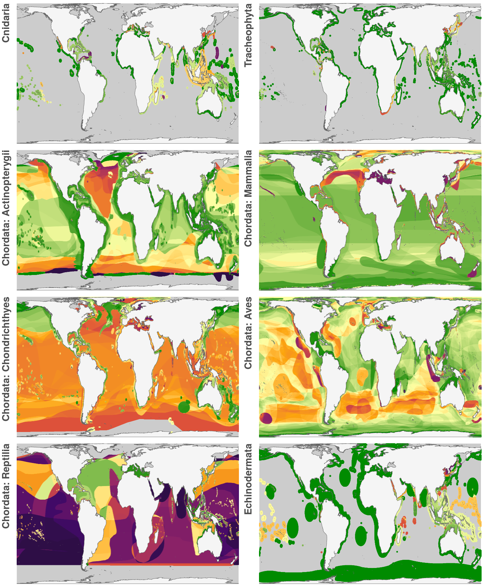
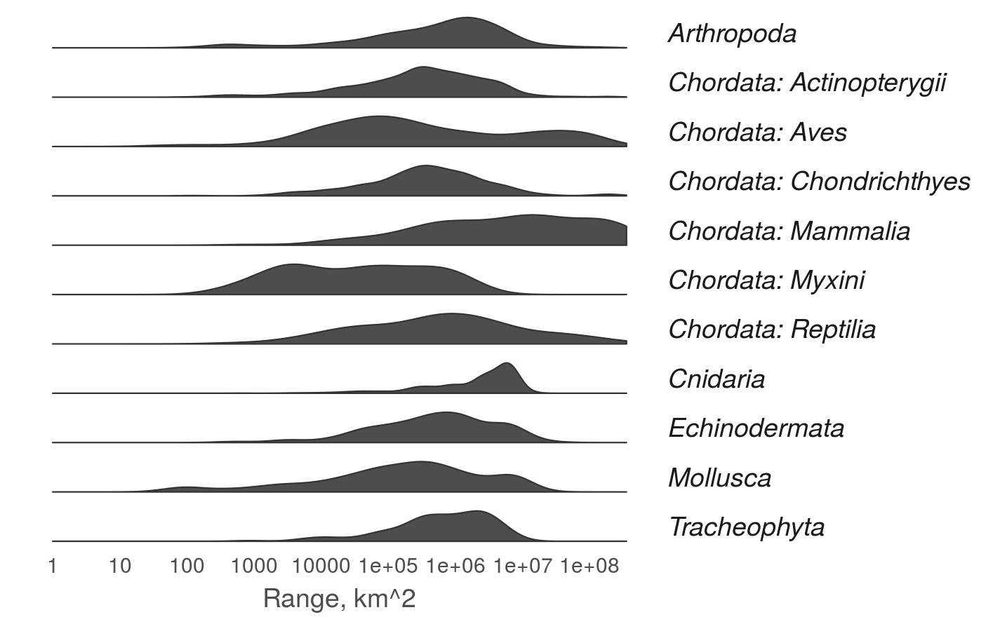

``` {r setup, echo = TRUE, message = FALSE, warning = FALSE}

knitr::opts_chunk$set(fig.width = 6, fig.height = 4, fig.path = 'figs/',
                      echo = TRUE, message = FALSE, warning = FALSE)

library(sf)
library(raster)
library(data.table)

source('https://raw.githubusercontent.com/oharac/src/master/R/common.R')
  ### includes library(tidyverse); library(stringr); 
  ### dir_M points to ohi directory on Mazu; dir_O points to home dir on Mazu

dir_git <- '~/github/spp_risk_dists'

### goal specific folders and info
dir_setup <- file.path(dir_git, 'data_setup')
dir_data  <- file.path(dir_git, 'data')
dir_o_anx <- file.path(dir_O, 'git-annex/spp_risk_dists')

source(file.path(dir_git, 'data_setup/common_fxns.R'))

### Gall-Peters doesn't have an EPSG?
gp_proj4 <- '+proj=cea +lon_0=0 +lat_ts=45 +x_0=0 +y_0=0 +ellps=WGS84 +units=m +no_defs'

```

# Summary

Compare MPAs to biodiversity intactness: 

# Methods

## set up taxonomic groups

``` {r set up taxa groupings}

shp_to_taxa <- read_csv(file.path(dir_git, 'data_setup/raw', 'shps_to_taxa.csv'))

taxa_sums <- data.frame(unweighted = list.files(file.path(dir_o_anx, 'taxa_summaries'),
                                                pattern = sprintf('cell_sum_%s.csv', api_version),
                                                full.names = TRUE),
                        rr_weighted = list.files(file.path(dir_o_anx, 'taxa_summaries'),
                                                pattern = sprintf('cell_sum_rrweight_%s.csv', api_version),
                                                full.names = TRUE)) %>%
  mutate(shp_basename = str_replace_all(basename(unweighted), '_cell_sum.+|_part.+', '')) %>%
  left_join(shp_to_taxa, by = 'shp_basename')

spp_maps <- read_csv(file.path(dir_git, 'data', sprintf('spp_marine_maps_%s.csv', api_version)),
                     col_types = 'ddciccc') %>%
  mutate(shp_basename = str_replace_all(tolower(dbf_file), '_part.+|.dbf', '')) %>%
  select(iucn_sid, shp_basename) %>%
  distinct() %>%
  group_by(shp_basename) %>%
  summarize(n_spp = n()) %>%
  left_join(taxa_sums, by = 'shp_basename') %>%
  select(taxon, n_spp) %>%
  distinct() %>%
  group_by(taxon) %>%
  summarize(n_spp = sum(n_spp)) %>%
  arrange(desc(n_spp))

```

### maps of rr-risk by taxa

``` {r mean_risk_raster, results = 'asis', eval = TRUE}

reload <- TRUE

rast_base <- raster(file.path(dir_git, 'spatial', 'cell_id_rast.tif'))

land_poly <- sf::read_sf(file.path(dir_git, 'spatial/ne_10m_land/ne_10m_land.shp')) %>%
  st_transform(gp_proj4)

taxa_gps <- c("Cnidaria",
              "Tracheophyta",
              "Chordata: Actinopterygii",
              "Chordata: Mammalia",
              "Chordata: Chondrichthyes",
              "Chordata: Aves",
              "Chordata: Reptilia",
              "Echinodermata")

map_list <- vector('list', length = length(taxa_gps)) %>%
  setNames(taxa_gps)

taxa_map_file <- file.path(dir_git, 'ms_figures/fig2_taxa_maps.png')

for(i in seq_along(taxa_gps)) { ### i <- 1
    
  taxon_gp <- taxa_gps[i]
  taxon_txt <- taxon_gp %>% tolower() %>% str_replace_all('chordata: |[^a-z]+', '')

  taxa_info <- taxa_sums %>%
    filter(taxon == taxon_gp)
  
  cat_msg('Processing ', taxon_gp)
  
  rr_weighted_files <- taxa_info$rr_weighted %>% unique()
  
  taxon_df_rr <- parallel::mclapply(rr_weighted_files, mc.cores = 12,
      FUN = function (x) { ### x <- rr_weighted_files[1]
        read_csv(x, col_types = 'ddd___d___')
      }) %>% 
    bind_rows() %>%
    group_by(cell_id) %>%
    summarize(mean_risk_sum = 1/sum(sr_rr_risk) * sum(mean_risk * sr_rr_risk),
              pct_threat_sum = sum(sr_rr_threatened) / sum(sr_rr_risk)) %>%
    select(cell_id, mean_risk_sum, pct_threat_sum) %>%
    mutate(wt = 'rr_weighted')
  
  mean_rr_rast <- subs(rast_base, taxon_df_rr, by = 'cell_id', which = 'mean_risk_sum')

  mean_rr_df <- mean_rr_rast %>% 
    aggregate(fact = 2) %>%
      ### should look OK for tiny maps?
    rasterToPoints() %>% 
    as.data.frame() %>%
    setNames(c('long', 'lat', 'value'))

  ### This color scheme and label scheme matches the mean risk maps
  colors = c('green4', viridis::inferno(6, direction = -1))
  values = c(0, .2, .3, .4, .5, .7, 1.0)
  labels = c('LC', 'NT', 'VU', 'EN', 'CR', 'EX')
  breaks = c( 0.0,  0.2,  0.4,  0.6,  0.8,  1.0)

  x <- ggplot(mean_rr_df) +
    geom_raster(aes(long, lat, fill = value), show.legend = FALSE) +
    geom_sf(data = land_poly, aes(geometry = geometry), 
            fill = 'grey96', color = 'grey40', size = .10) +
    ggtheme_map() +
    theme(plot.margin = unit(c(.05, .2, .2, .2), units = 'cm'),
          panel.background = element_rect(fill = 'grey80'),
          axis.title = element_text(face = 'bold', hjust = 1),
          axis.title.x = element_blank()) +
    coord_sf(datum = NA) + ### ditch graticules
    scale_fill_gradientn(colors = colors, values = values, limits = c(0, 1),
                         labels = labels, breaks = breaks,
                         guide  = guide_colourbar(label.position = 'left',
                                                  label.hjust = 1)) +
    scale_x_continuous(expand = c(0, 0)) +
    scale_y_continuous(expand = c(0, 0)) +
    labs(y = taxon_gp)

  map_list[[i]] <- x
  
}

cat_msg('done, putting together the cowplot')

y <- cowplot::plot_grid(plotlist = map_list, align = 'hv', ncol = 2)

plot_w <- 6
plot_h <- plot_w / (2 * 1.6) * ceiling(length(map_list) / 2)

ggsave(plot = y,
       filename = taxa_map_file,
       width = plot_w, height = plot_h, units = 'in', dpi = 300)
```



## Plots of ranges by taxonomic group

``` {r, eval = FALSE}

spp_ranges <- read_csv(file.path(dir_data, sprintf('iucn_spp_range_area_%s.csv', api_version)),
                         col_types = 'dd__') %>%
  distinct()

taxa_ranges <- read_csv(file.path(dir_git, 'data', sprintf('spp_marine_maps_%s.csv', api_version)),
                     col_types = 'ddciccc') %>%
  mutate(shp_basename = str_replace_all(basename(tolower(dbf_file)), '.dbf|_part.+', '')) %>%
  left_join(spp_ranges, by = 'iucn_sid') %>%
  left_join(shp_to_taxa, by = 'shp_basename') %>%
  mutate(log_range = log10(range_km2))

ggplot(taxa_ranges, aes(x = log_range, ..scaled..)) +
  ggtheme_plot() +
  theme(panel.grid.major = element_blank(),
        axis.text.y      = element_blank(),
        axis.title.y     = element_blank(),
        strip.text.y = element_text(angle = 0, hjust = 0)) +
  geom_density(color = 'grey20', size = .25, fill = 'grey30') +
  scale_x_continuous(limits = c(0, NA),
                     breaks = c(0:8),
                     labels = 10^(0:8)) +
  labs(x = 'Range, km^2') +
  facet_grid(taxon ~ .)

ggsave(filename = file.path(dir_git, 'ms_figures', 'fig_SI_taxa_ranges.png'), 
           width = 6, height = 4, units = 'in', dpi = 300)

```


