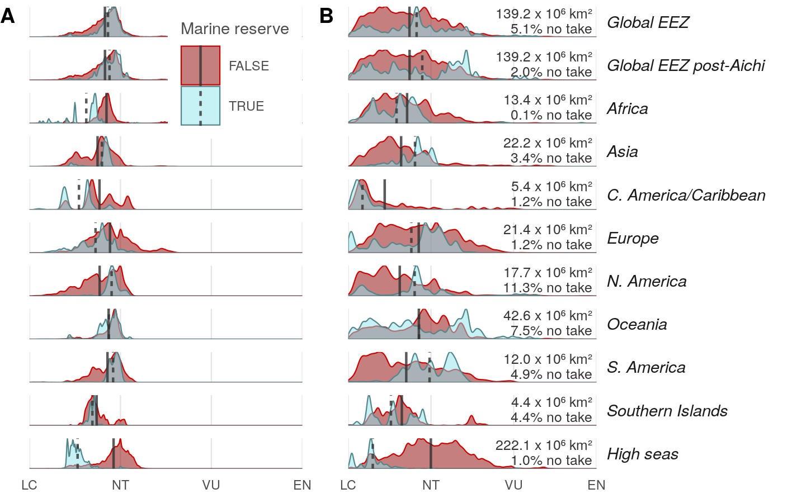

``` {r setup, echo = TRUE, message = FALSE, warning = FALSE}

knitr::opts_chunk$set(fig.width = 6, fig.height = 4, fig.path = 'figs/',
                      echo = TRUE, message = FALSE, warning = FALSE)

library(raster)
library(data.table)

source('https://raw.githubusercontent.com/oharac/src/master/R/common.R')
  ### includes library(tidyverse); library(stringr); 
  ### dir_M points to ohi directory on Mazu; dir_O points to home dir on Mazu

dir_git <- '~/github/spp_risk_dists'

### goal specific folders and info
dir_setup <- file.path(dir_git, 'data_setup')
dir_data  <- file.path(dir_git, 'data')
dir_o_anx <- file.path(dir_O, 'git-annex/spp_risk_dists')

source(file.path(dir_git, 'data_setup/common_fxns.R'))

```

# Summary

Compare MPAs to biodiversity intactness: 

# Methods

## Compare MPA coverage to biodiversity risk

MPA coverage will be compared to non-MPA areas within EEZs.  The .csv codes MPAs as their numeric IUCN category (i.e. Ia = Ib = 1, II = 2, ..., VI = 6); areas that are specifically designated as no-take (that are not already in categories Ia, Ib, and II) are coded as -1; areas that are designated in the WDPA database but do not fall into one of these categories are coded as 8.

``` {r set up mpa and values dataframe}

mean_rast     <- raster(file.path(dir_git, 'output', 'mean_risk_raster.tif'))
eez_rast      <- raster(file.path(dir_git, 'spatial', 'eez_rast.tif'))
ocean_area_rast <- raster(file.path(dir_git, 'spatial', 'ocean_area_rast.tif'))

risk_df <- data.frame(cell_id   = 1:length(values(mean_rast)),
                      ocean_area = values(ocean_area_rast),
                      eez       = values(eez_rast),
                      mean_risk = values(mean_rast)) %>%
  filter(eez %in% c(1:212, 214:254, 256:277)) %>% 
    ### 213 is Antarctica, 255 is disputed territories, >255 is high seas
  filter(!is.na(mean_risk))


```

``` {r set up no take vs risk df}

mpa_df   <- read_csv(file.path(dir_git, 'spatial', 'wdpa_mpa_area.csv'),
                          col_types = 'dddd') %>%
  filter(wdpa_category <= 2) %>%
  select(-wdpa_category) %>%
  group_by(cell_id) %>%
  summarize(mpa = sum(prot_area_km2, na.rm = TRUE))


risk_mpa_df <- risk_df %>%
  left_join(mpa_df, by = 'cell_id') %>%
  left_join(read_csv(file.path(dir_git, 'spatial/rgn_names.csv')), by = c('eez' = 'rgn_id')) %>%
  mutate(r1_label = str_replace(r1_label, 'Latin Am.+', 'Latin America')) %>%
  mutate(mpa = ifelse(is.na(mpa), 0, mpa),
         mpa = ifelse(mpa > ocean_area, ocean_area, mpa),
         non_mpa = ocean_area - mpa) %>%
  gather(mpa_status, area, mpa, non_mpa) %>%
  mutate(mpa_status = (mpa_status == 'mpa'))


# no_take_median_yr <- read_csv(file.path(dir_git, 'spatial', 'wdpa_mpa_year.csv'),
#                            col_types = 'dddd') %>%
#   arrange(mpa_year) %>%
#   mutate(prot_area_cum = cumsum(prot_area_km2)) %>%
#   filter(prot_area_cum >= median(prot_area_cum)) %>%
#   .$mpa_year %>% first() 
### 2010 seems to be area-weighted median year for no-take ocean protection.

yr_cut <- 2010
mpa_recent_df <- read_csv(file.path(dir_git, 'spatial', 'wdpa_mpa_year.csv'),
                           col_types = 'dddd') %>%
  filter(mpa_year >= yr_cut) %>%
  group_by(cell_id) %>%
  summarize(mpa = sum(prot_area_km2, na.rm = TRUE))

risk_mpa_recent_df <- risk_df %>%
  left_join(mpa_recent_df, by = 'cell_id') %>%
  left_join(read_csv(file.path(dir_git, 'spatial/rgn_names.csv')), by = c('eez' = 'rgn_id')) %>%
  mutate(r1_label = str_replace(r1_label, 'Latin Am.+', 'Latin America')) %>%
  mutate(mpa = ifelse(is.na(mpa), 0, mpa),
         mpa = ifelse(mpa > ocean_area, ocean_area, mpa),
         non_mpa = ocean_area - mpa) %>%
  gather(mpa_status, area, mpa, non_mpa) %>%
  mutate(mpa_status = (mpa_status == 'mpa'))

```

To capture area of partially protected cells, use `geom_density(aes(weight = area, x = mean_risk, ..scaled..))`

``` {r no take mpas, eval = TRUE}

global_no_take <- risk_mpa_df %>%
  filter(eez < 255) %>%
  mutate(lbl = 'Global') %>%
  select(cell_id, mean_risk, mpa_status, area, lbl) %>%
  group_by(lbl, mpa_status) %>%
  mutate(area = area / sum(area)) %>%
  ungroup()

global_no_take_recent <- risk_mpa_recent_df %>%
  filter(eez < 255) %>%
  mutate(lbl = paste0('Global post-', yr_cut)) %>%
  select(cell_id, mean_risk, mpa_status, area, lbl) %>%
  group_by(lbl, mpa_status) %>%
  mutate(area = area / sum(area)) %>%
  ungroup()

highseas_no_take <- risk_mpa_df %>%
  filter(eez > 255) %>%
  mutate(lbl = 'High seas', 
         mpa_status = FALSE) %>%
  select(cell_id, mean_risk, mpa_status, area, lbl) %>%
  group_by(lbl, mpa_status) %>%
  mutate(area = area / sum(area)) %>%
  ungroup()

rgn_no_take <- risk_mpa_df %>%
  filter(eez < 255) %>%
  mutate(lbl = r1_label) %>%
  arrange(lbl) %>%
  select(cell_id, mean_risk, mpa_status, area, lbl) %>%
  group_by(lbl, mpa_status) %>%
  mutate(area = area / sum(area)) %>%
  ungroup()

no_take_df <- bind_rows(global_no_take, global_no_take_recent, 
                        rgn_no_take, highseas_no_take) %>%
  mutate(lbl = forcats::fct_inorder(lbl))
# no_take_df$lbl %>% levels()

no_take_means <- no_take_df %>%
  group_by(mpa_status, lbl) %>%
  summarize(mu = sum(mean_risk * area)) %>%
  ungroup()
  
```


``` {r set up overall rr-weighted dataframe}

mean_rr_rast      <- raster(file.path(dir_git, 'output', 'mean_rr_risk_raster.tif'))

risk_rr_df <- data.frame(cell_id    = 1:length(values(mean_rr_rast)),
                         ocean_area = values(ocean_area_rast),
                         eez        = values(eez_rast),
                         mean_risk  = values(mean_rr_rast)) %>%
  filter(!is.na(mean_risk)) %>%
  filter(eez %in% c(1:212, 214:254, 256:277))

```

``` {r set up no take vs risk rr df}

risk_mpa_rr_df <- risk_rr_df %>%
  left_join(mpa_df, by = 'cell_id') %>%
  left_join(read_csv(file.path(dir_git, 'spatial/rgn_names.csv')), by = c('eez' = 'rgn_id')) %>%
  mutate(r1_label = str_replace(r1_label, 'Latin Am.+', 'Latin America')) %>%
  mutate(mpa = ifelse(is.na(mpa), 0, mpa),
         mpa = ifelse(mpa > ocean_area, ocean_area, mpa),
         non_mpa = ocean_area - mpa) %>%
  gather(mpa_status, area, mpa, non_mpa) %>%
  mutate(mpa_status = (mpa_status == 'mpa'))

risk_mpa_rr_recent_df <- risk_rr_df %>%
  left_join(mpa_recent_df, by = 'cell_id') %>%
  left_join(read_csv(file.path(dir_git, 'spatial/rgn_names.csv')), by = c('eez' = 'rgn_id')) %>%
  mutate(r1_label = str_replace(r1_label, 'Latin Am.+', 'Latin America')) %>%
  mutate(mpa = ifelse(is.na(mpa), 0, mpa),
         mpa = ifelse(mpa > ocean_area, ocean_area, mpa),
         non_mpa = ocean_area - mpa) %>%
  gather(mpa_status, area, mpa, non_mpa) %>%
  mutate(mpa_status = (mpa_status == 'mpa'))

```

``` {r rr-weighted protection level dataframes}

global_no_take_rr <- risk_mpa_rr_df %>%
  filter(eez < 255) %>%
  mutate(lbl = 'Global') %>%
  select(cell_id, mean_risk, mpa_status, area, lbl) %>%
  group_by(lbl, mpa_status) %>%
  mutate(area = area / sum(area)) %>%
  ungroup()

global_no_take_rr_recent <- risk_mpa_rr_recent_df %>%
  filter(eez < 255) %>%
  mutate(lbl = paste0('Global post-', yr_cut)) %>%
  select(cell_id, mean_risk, mpa_status, area, lbl) %>%
  group_by(lbl, mpa_status) %>%
  mutate(area = area / sum(area)) %>%
  ungroup()

highseas_no_take_rr <- risk_mpa_rr_df %>%
  filter(eez > 255) %>%
  mutate(lbl = 'High seas', 
         mpa_status = FALSE) %>%
  select(cell_id, mean_risk, mpa_status, area, lbl) %>%
  group_by(lbl, mpa_status) %>%
  mutate(area = area / sum(area)) %>%
  ungroup()


rgn_no_take_rr <- risk_mpa_rr_df %>%
  filter(eez < 255) %>%
  mutate(lbl = r1_label) %>%
  arrange(lbl) %>%
  select(cell_id, mean_risk, mpa_status, area, lbl) %>%
  group_by(lbl, mpa_status) %>%
  mutate(area = area / sum(area)) %>%
  ungroup()

no_take_rr_df <- bind_rows(global_no_take_rr, global_no_take_rr_recent, 
                           rgn_no_take_rr, highseas_no_take_rr) %>%
  mutate(lbl = forcats::fct_inorder(lbl))
# no_take_df$lbl %>% levels()

no_take_rr_means <- no_take_rr_df %>%
  group_by(mpa_status, lbl) %>%
  summarize(mu = sum(mean_risk * area)) %>%
  ungroup()
  
```

There seem to be two philosophies of MPA priority: place MPAs in impacted areas to reduce pressure and prevent further degradatation, or place MPAs to protect pristine places to maintain their pristine state.  This suggests that we may see a bimodal distribution of mean risk within MPA cells relative to the distribution of mean risk in general.

### Mean risk

``` {r plot_function}
plot_dist <- function(df, means_df, var_name, x_lims = c(0, .75)) {
  x <- ggplot(df, aes(x = mean_risk, fill = mpa_status, color = mpa_status)) +
    ggtheme_plot() +
    theme(strip.text.y = element_text(angle = 0, hjust = 0),
          axis.text.y  = element_blank(),
          axis.title   = element_blank(),
          panel.grid.major.y = element_blank()) +
    geom_density(aes(weight = area, x = mean_risk), alpha = .5, size = .25) +
    geom_vline(data = means_df, 
               aes(xintercept = mu, linetype = mpa_status),
               alpha = .8) +
    scale_x_continuous(expand = c(0, 0), 
                       limits = x_lims,
                       labels = c('LC', 'NT', 'VU', 'EN', 'CR', 'EX'),
                       breaks = c( 0.0,  0.2,  0.4,  0.6,  0.8,  1.0)) +
    scale_y_continuous(expand = c(0, 0)) +
    scale_fill_manual(values  = c('red4', 'cadetblue2')) +
    scale_color_manual(values = c('red3', 'cadetblue4')) +
    facet_grid( lbl ~ ., scales = 'free_y') +
    labs(fill = var_name, color = var_name, linetype = var_name)
  
  return(x)
}

```

``` {r generate figure}

mpa_plot_unweighted <- plot_dist(no_take_df, no_take_means, 'No take')

mpa_plot_rrweighted <- plot_dist(no_take_rr_df, no_take_rr_means, 'No take')

plot_combined <- cowplot::plot_grid(mpa_plot_unweighted +
                                      theme(strip.text.y = element_blank(),
                                            legend.justification = c(1, 1), 
                                            legend.position = c(1, 1)), 
                                    mpa_plot_rrweighted +
                                      theme(legend.position = 'none'), 
                                    labels = c('A', 'B'),
                                    rel_widths = c(3, 4))

ggsave(file.path(dir_git, 'ms_figures/fig3_bd_risk_vs_mpas.png'),
       height = 4, width = 6, dpi = 300, units = 'in')
```



### unweighted means

`r knitr::kable(no_take_means)`

### rr-weighted means

`r knitr::kable(no_take_rr_means)`
