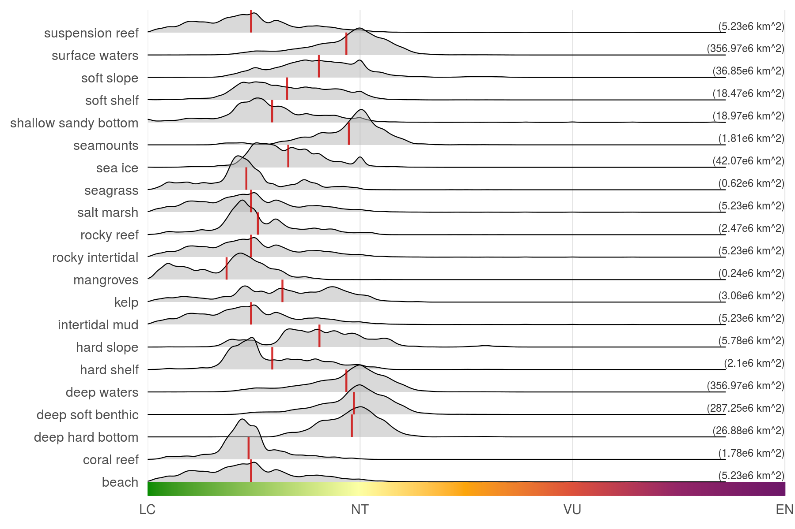

``` {r setup, echo = TRUE, message = FALSE, warning = FALSE}

knitr::opts_chunk$set(fig.width = 6, fig.height = 4, fig.path = 'figs/',
                      echo = TRUE, message = FALSE, warning = FALSE)

library(raster)
library(data.table)

source('https://raw.githubusercontent.com/oharac/src/master/R/common.R')
  ### includes library(tidyverse); library(stringr); 
  ### dir_M points to ohi directory on Mazu; dir_O points to home dir on Mazu

dir_git <- '~/github/spp_risk_dists'

### goal specific folders and info
dir_setup <- file.path(dir_git, 'data_setup')
dir_data  <- file.path(dir_git, 'data')
dir_o_anx <- file.path(dir_O, 'git-annex/spp_risk_dists')

source(file.path(dir_git, 'data_setup/common_fxns.R'))

```

# Summary

Compare biodiversity risk within various marine habitats

# Methods

## Compare biodiversity risk to habitats

Using CHI habs, compare biodiversity risk by habitat type.

``` {r set up hab raster to 1 km g-p}
habs_files <- list.files(file.path(dir_M, "git-annex/impact_acceleration/habitats"), 
                   pattern = '.tif$', full.names = TRUE)
dir_habs_reproj <- file.path(dir_o_anx, 'habs')
hab_stack <- stack(habs_files)

plot(hab_stack)

ocean_1km_file  <- file.path(dir_o_anx, 'spatial', 'ocean_1km.tif')
ocean_1km_rast <- raster(ocean_1km_file)

tmp <- parallel::mclapply(habs_files, mc.cores = 12, FUN = function(x) {
  ### x <- habs_files[1]
  reproj_file <- file.path(dir_habs_reproj, basename(x)) %>%
    str_replace('.tif$', '_1km.tif')
  if(!file.exists(reproj_file)) {
    y <- raster(x)
    z <- projectRaster(y, ocean_1km_rast, method = 'ngb',
                       # progress = 'text',
                       filename = reproj_file)
  }
})
```

10 km x 10 km habitat raster cells will contain values approximating the number of  km^2^ (out of 100) occupied by that habitat.

``` {r aggregate to 10 km g-p}

habs_1km_files <- list.files(dir_habs_reproj, 
                             pattern = '_1km.tif$',
                             full.names = TRUE)
habs_10km_files <- str_replace(habs_1km_files, '_1km.tif$', '_10km.tif') %>%
  setNames(habs_1km_files)
rast_base <- raster(file.path(dir_git, 'spatial', 'cell_id_rast.tif'))

for(hab_1km in habs_1km_files) {
  ### hab_1km <- habs_1km_files[1]
  out_file <- habs_10km_files[hab_1km]
  cat_msg('Processing ', basename(hab_1km), ' to: ', out_file)
  if(!file.exists(out_file)) {
    rast <- raster(hab_1km)
    rast_10km <- raster::aggregate(rast, fact = 10, fun = sum, na.rm = TRUE)
    writeRaster(rast_10km, out_file)
  }
}

z <- stack(habs_10km_files)
plot(z)
```


``` {r set up meow and values dataframe}

mean_rast       <- raster(file.path(dir_git, 'output', 
                                    'mean_risk_raster_comp.tif'))
ocean_area_rast <- raster(file.path(dir_git, 'spatial', 'ocean_area_rast.tif'))
habs_rasts <- stack(habs_10km_files)

habs_df <- data.frame(x = values(habs_rasts[[1]]))
for(i in 2:nlayers(habs_rasts)) {
  habs_df[ , i] <- values(habs_rasts[[i]])
}

risk_df <- habs_df %>%
  setNames(basename(habs_10km_files)) %>%
  mutate(risk = values(mean_rast),
         area = values(ocean_area_rast)) %>%
  gather(hab, cells, -risk, -area) %>%
  filter(!is.na(cells) & cells != 0 & !is.na(risk))

# x <- risk_df %>% select(hab) %>% distinct()
# write_csv(x, file.path(dir_git, 'data_setup/raw/hab_names_raw.csv'))
habs_lookup <- read_csv(file.path(dir_git, 'data_setup/raw', 
                                  'hab_names_lookup.csv'))

risk_df <- risk_df %>%
  left_join(habs_lookup, by = 'hab')

means_df <- risk_df %>%
  group_by(hab_desc) %>%
  summarize(mean_risk = mean(risk, na.rm = TRUE),
            area_km2 = round(sum(area) / 1e6, 2),
            area_lbl = paste0('(', area_km2, 'e6 km^2)')) %>%
  mutate(hab_desc = fct_inorder(hab_desc),
         hab_num = as.integer(hab_desc),
         hab_num_next = hab_num + 1)
```


``` {r ridgeline plot by hab}

library(ggridges)

colorbar_df <- data.frame(x = seq(0, 1, .001), y = -1)

x <- ggplot(risk_df, aes(x = risk, y = hab_desc)) +
  ggtheme_plot() +
  theme(strip.text.y = element_text(angle = 0, hjust = 0),
        axis.title   = element_blank(),
        panel.grid.major.y = element_blank()) +
  geom_segment(data = colorbar_df, 
               aes(x = x, xend = x, color = x), 
               y = 0, yend = 1, size = 1,
               show.legend = FALSE) +
  geom_density_ridges(alpha = .5, size = .25, rel_min_height = 0,
                      show.legend = FALSE) +
  geom_linerange(data = means_df,
                 aes(x = mean_risk, ymin = hab_num, ymax = hab_num_next),
             color = 'red3', alpha = .8) +
  geom_text(data = means_df, aes(x = .6, label = area_lbl),
            hjust = 1, color = 'grey20', size = 2, nudge_y = .3) +
  scale_x_continuous(expand = c(0, 0),
                     limits = c(0, .6),
                     labels = c('LC', 'NT', 'VU', 'EN', 'CR', 'EX'),
                     breaks = c( 0.0,  0.2,  0.4,  0.6,  0.8,  1.0)) +
  scale_color_gradientn(colors = c('green4', viridis::inferno(6, direction = -1)),
                          ### use viridis scheme but add green on the bottom for LC
                        values = c(0, .2, .3, .4, .5, .7, 1.0))
  # +
  # scale_fill_gradientn(colors = c('green4', viridis::inferno(6, direction = -1)),
  #                               ### use viridis scheme but add green on the bottom for LC
  #                      values = c(0, .2, .3, .4, .5, .7, 1.0),
  #                      labels = c('LC', 'NT', 'VU', 'EN', 'CR', 'EX'),
  #                      breaks = c( 0.0,  0.2,  0.4,  0.6,  0.8,  1.0))

ggsave(file.path(dir_git, 'ms_figures', 'fig4_by_habitat.png'),
       height = 4, width = 6, dpi = 300)
```

