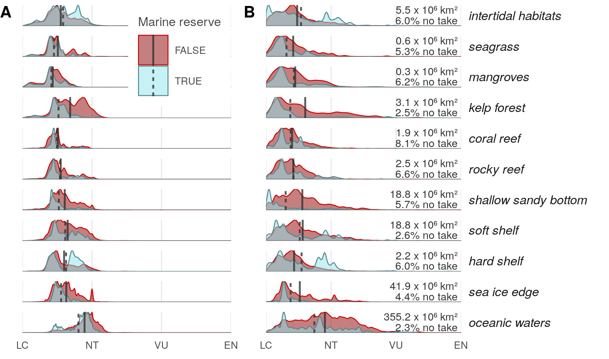

``` {r setup, echo = TRUE, message = FALSE, warning = FALSE}

knitr::opts_chunk$set(fig.width = 6, fig.height = 4, fig.path = 'figs/',
                      echo = TRUE, message = FALSE, warning = FALSE)

library(raster)
source('https://raw.githubusercontent.com/oharac/src/master/R/common.R')
  ### includes library(tidyverse); library(stringr); 
  ### dir_M points to ohi directory on Mazu; dir_O points to home dir on Mazu
library(ggridges)

dir_git <- '~/github/spp_risk_dists'

### goal specific folders and info
dir_data  <- file.path(dir_git, 'data')
dir_o_anx <- file.path(dir_O, 'git-annex/spp_risk_dists')

source(file.path(dir_git, 'setup/common_fxns.R'))

```

# Summary

Compare biodiversity risk within various marine habitats

# Methods

## Compare biodiversity risk to habitats

Using CHI habs, compare biodiversity risk by habitat type.

``` {r set up hab raster to 1 km g-p}
habs_files <- list.files(file.path(dir_M, "git-annex/impact_acceleration/habitats"), 
                   pattern = '.tif$', full.names = TRUE)
dir_habs_reproj <- file.path(dir_o_anx, 'habs')
hab_stack <- stack(habs_files)

# plot(hab_stack)

ocean_1km_file  <- file.path(dir_o_anx, 'spatial', 'ocean_1km.tif')
ocean_1km_rast <- raster(ocean_1km_file)

tmp <- parallel::mclapply(habs_files, mc.cores = 12, FUN = function(x) {
  ### x <- habs_files[1]
  reproj_file <- file.path(dir_habs_reproj, basename(x)) %>%
    str_replace('.tif$', '_1km.tif')
  if(!file.exists(reproj_file)) {
    y <- raster(x)
    z <- projectRaster(y, ocean_1km_rast, method = 'ngb',
                       # progress = 'text',
                       filename = reproj_file)
  }
})
```

10 km x 10 km habitat raster cells will contain values approximating the number of  km^2^ (out of 100) occupied by that habitat.

``` {r aggregate to 10 km g-p}

habs_1km_files <- list.files(dir_habs_reproj, 
                             pattern = '_1km.tif$',
                             full.names = TRUE)
habs_10km_files <- str_replace(habs_1km_files, '_1km.tif$', '_10km.tif') %>%
  setNames(habs_1km_files)
rast_base <- raster(file.path(dir_git, 'spatial', 'cell_id_rast.tif'))

for(hab_1km in habs_1km_files) {
  ### hab_1km <- habs_1km_files[1]
  out_file <- habs_10km_files[hab_1km]
  if(!file.exists(out_file)) {
    cat_msg('Processing ', basename(hab_1km), ' to: ', out_file)
    rast <- raster(hab_1km)
    rast_10km <- raster::aggregate(rast, fact = 10, fun = sum, na.rm = TRUE)
    writeRaster(rast_10km, out_file)
  }
}

z <- stack(habs_10km_files)
plot(z)
```


``` {r set up habs and values dataframe}

cell_id_rast    <- raster(file.path(dir_git, 'spatial', 'cell_id_rast.tif'))
mean_rast       <- raster(file.path(dir_git, 'output', 
                     'mean_risk_raster_comp.tif'))
mean_rr_rast    <- raster(file.path(dir_git, 'output', 
                     'mean_rr_risk_raster_comp.tif'))
pct_th_rast     <- raster(file.path(dir_git, 'output', 
                     'pct_threat_raster_comp.tif'))
pct_th_rr_rast  <- raster(file.path(dir_git, 'output', 
                     'sr_rr_pct_threat_raster_comp.tif'))
ocean_area_rast <- raster(file.path(dir_git, 'spatial', 'ocean_area_rast.tif'))


habs_10km_files <- list.files(file.path(dir_o_anx, 'habs'), 
                             pattern = '_10km.tif$',
                             full.names = TRUE)
habs_rasts <- stack(habs_10km_files)

### initialize df with cell ID rast, then add columns for habs
habs_df <- data.frame(cell_id = values(cell_id_rast))
for(i in 1:nlayers(habs_rasts)) {
  habs_df[ , i + 1] <- values(habs_rasts[[i]])
} ### note: data.frame with cols cell_id and V1-V22
habs_df <- habs_df %>%
  setNames(c('cell_id', basename(habs_10km_files)))

mpa_df   <- read_csv(file.path(dir_git, 'spatial', 'wdpa_mpa_area.csv'),
                          col_types = 'dddd') %>%
  filter(wdpa_category <= 2) %>%
  select(-wdpa_category) %>%
  group_by(cell_id) %>%
  summarize(mpa = sum(prot_area_km2, na.rm = TRUE))

risk_df <- habs_df %>%
  mutate(risk       = values(mean_rast),
         rr_risk    = values(mean_rr_rast),
         pct_th     = values(pct_th_rast),
         rr_pct_th  = values(pct_th_rr_rast),
         ocean_area = values(ocean_area_rast)) %>%
  gather(hab, cells, -cell_id, -(risk:ocean_area)) %>%
  filter(!is.na(cells) & cells != 0 & !is.na(risk)) 

risk_mpa_df <- risk_df %>%
  left_join(mpa_df, by = 'cell_id') %>%
  mutate(mpa = ifelse(is.na(mpa), 0, mpa),
         mpa = ifelse(mpa > ocean_area, ocean_area, mpa),
         non_mpa = ocean_area - mpa) %>%
  gather(mpa_status, area, mpa, non_mpa) %>%
  mutate(mpa_status = (mpa_status == 'mpa'))


# x <- risk_df %>% select(hab) %>% distinct()
# write_csv(x, file.path(dir_git, 'data_setup/raw/hab_names_raw.csv'))
habs_lookup <- read_csv(file.path(dir_git, 'setup/raw', 
                                  'hab_names_lookup.csv'))

risk_mpa_df <- risk_mpa_df %>%
  left_join(habs_lookup, by = 'hab') %>%
  filter(!is.na(order)) %>%
  arrange(order) %>%
  mutate(hab_desc = fct_inorder(hab_desc))

risk_mpa_df <- risk_mpa_df %>%
  arrange(hab_desc) %>%
  select(cell_id, risk, rr_risk, mpa_status, area, hab_desc) %>%
  group_by(hab_desc, mpa_status) %>%
  mutate(prop_area = area / sum(area)) %>%
  ungroup()

prot_pct <- risk_mpa_df %>%
  group_by(hab_desc) %>%
  summarize(pct_prot = sum(area * mpa_status) / sum(area) * 100,
            tot_area = sum(area))
### this is independent of range-rarity weighting

no_take_means <- risk_mpa_df %>%
  group_by(mpa_status, hab_desc) %>%
  summarize(mu    = sum(risk * prop_area),
            mu_rr = sum(rr_risk * prop_area)) %>%
  ungroup()

write_csv(no_take_means, file.path(dir_git, 'setup/int/mpa_mean_risks_by_hab.csv'))

rm('habs_df', 'risk_df')

```

## Facet plot

``` {r plot_function}

plot_dist <- function(df, means_df, x_lims = c(0, 0.6)) {

  x <- ggplot(df, aes(x = risk)) +
    ggtheme_plot() +
    theme(strip.text.y = element_text(angle = 0, hjust = 0),
          axis.text.y  = element_blank(),
          axis.title   = element_blank(),
          panel.grid.major.y = element_blank(),
          plot.margin = unit(c(.1, .25, .1, .35), 'cm')) +
    geom_density(aes(weight = area, x = risk, ..scaled..,
                     fill = mpa_status, color = mpa_status),
                 alpha = .5, size = .25) +
    geom_vline(data = means_df, 
               aes(xintercept = mu, linetype = mpa_status),
               color = 'grey20', alpha = .8) +
    scale_x_continuous(expand = c(0, 0), 
                       limits = x_lims,
                       labels = c('LC', 'NT', 'VU', 'EN', 'CR', 'EX'),
                       breaks = c( 0.0,  0.2,  0.4,  0.6,  0.8,  1.0)) +
    scale_y_continuous(expand = c(0, 0)) +
    scale_fill_manual(values  = c('red4', 'cadetblue2')) +
    scale_color_manual(values = c('red3', 'cadetblue4')) +
    facet_grid( hab_desc ~ ., scales = 'free_y') +
    labs(fill = 'Marine reserve', color = 'Marine reserve', linetype = 'Marine reserve')
  
  return(x)
}

```

``` {r generate figure}
prot_pct_lbls <- prot_pct %>%
  mutate(area_lbl = sprintf('%.1f x 10⁶ km²', tot_area/1e6),
         prot_lbl = sprintf('%.1f%% marine reserve', pct_prot))

hab_plot_unweighted <- plot_dist(risk_mpa_df, no_take_means) +
  theme(strip.text.y = element_blank())

hab_plot_rrweighted <- plot_dist(risk_mpa_df %>% select(-risk, risk = rr_risk), 
                                 no_take_means %>% 
                                   select(-mu, mu = mu_rr)) +
  geom_text(data = prot_pct_lbls, aes(x = .58, y = .9, label = area_lbl), 
            hjust = 1, size = 2.2, vjust = 1) +
  geom_text(data = prot_pct_lbls, aes(x = .58, y = .5, label = prot_lbl), 
            hjust = 1, size = 2.2, vjust = 1)

plot_combined <- cowplot::plot_grid(hab_plot_unweighted +
                                      theme(strip.text.y = element_blank(),
                                            legend.justification = c(1, 1), 
                                            legend.position = c(1, 1)), 
                                    hab_plot_rrweighted +
                                      theme(legend.position = 'none'), 
                                    labels = c('A', 'B'), hjust = 0,
                                    rel_widths = c(2, 3))

ggsave(file.path(dir_git, 'ms_figures/fig4_bd_risk_vs_habitat.png'),
       height = 4.5, width = 6, dpi = 300, units = 'in')

```




## Wherefore the big difference between oceanic waters and high seas in terms of protected coverage?

Examine where MPAs in open ocean and MPAs in EEZs overlap.

```{r}
cell_id_rast <- raster(file.path(dir_git, 'spatial', 'cell_id_rast.tif'))
mean_rast    <- raster(file.path(dir_git, 'output', 
                     'mean_risk_raster_comp.tif'))

surf_10km_file <- list.files(file.path(dir_o_anx, 'habs'), 
                             pattern = 'surface_waters_10km.tif$',
                             full.names = TRUE)
surf_rast <- raster(surf_10km_file)
eez_rast  <- raster(file.path(dir_git, 'spatial', 'eez_rast.tif'))
mpa_df    <- read_csv(file.path(dir_git, 'spatial', 'wdpa_mpa_area.csv'),
                          col_types = 'dddd') %>%
  filter(wdpa_category <= 2) %>%
  select(-wdpa_category) %>%
  group_by(cell_id) %>%
  summarize(mpa = sum(prot_area_km2, na.rm = TRUE))

df <- data.frame(cell_id = values(cell_id_rast),
                 risk   = values(mean_rast),
                 ocean  = values(surf_rast),
                 eez    = values(eez_rast)) %>%
  filter(!is.na(risk)) %>%
  left_join(mpa_df, by = 'cell_id')

ocean_prot_sum <- df %>%
  filter(!is.na(ocean)) %>%
  group_by(eez) %>%
  summarize(prot = sum(mpa, na.rm = TRUE),
            total = n()) %>%
  filter(prot > 0)

ocean_prot <- df %>%
  filter(!is.na(ocean)) %>%
  filter(!is.na(mpa)) %>%
  mutate(abnj = ifelse((eez == 213 | eez > 255), 1, -1))

ocean_prot_rast <- subs(cell_id_rast, ocean_prot, by = 'cell_id', which = 'abnj')

### print map
library(sf)
land_poly <- read_sf(file.path(dir_git, 'spatial/ne_10m_land/ne_10m_land.shp')) %>%
  st_transform(gp_proj4)

map_df <- rasterToPoints(ocean_prot_rast) %>%
  as.data.frame() %>%
  setNames(c('long', 'lat', 'abnj'))

map1 <- ggplot(map_df) +
  geom_raster(aes(long, lat, fill = abnj), show.legend = TRUE) +
  geom_sf(data = land_poly, aes(geometry = geometry), 
          fill = 'grey96', color = 'grey40', size = .10) +
  ggtheme_map() +
  theme(plot.margin = unit(c(.2, 0, .1, .5), units = 'cm')) +
  coord_sf(datum = NA) + ### ditch graticules
  scale_x_continuous(expand = c(0, 0)) +
  scale_y_continuous(expand = c(0, 0))
  
print(map1)

```