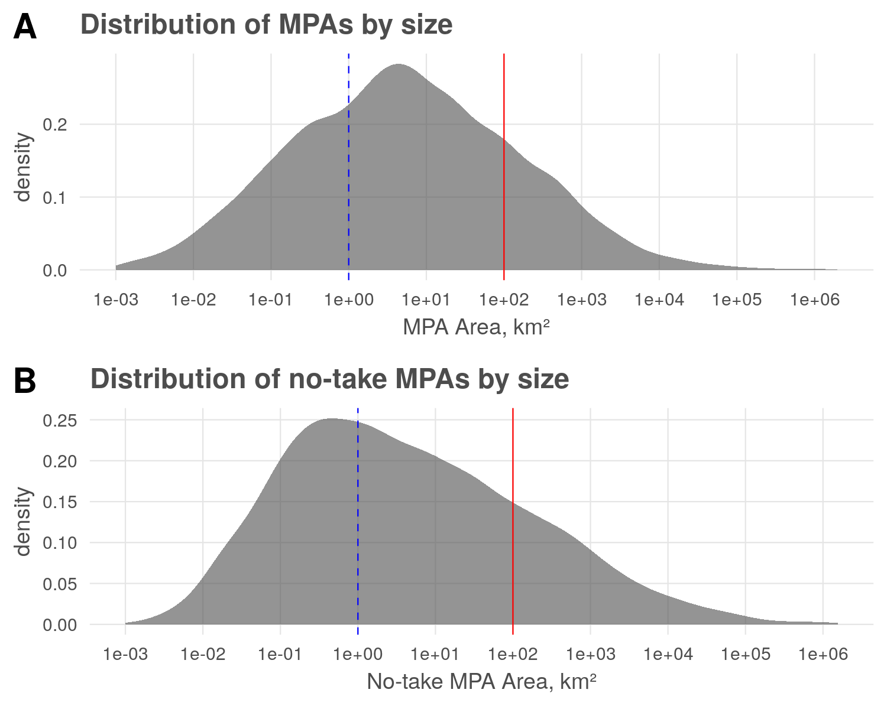
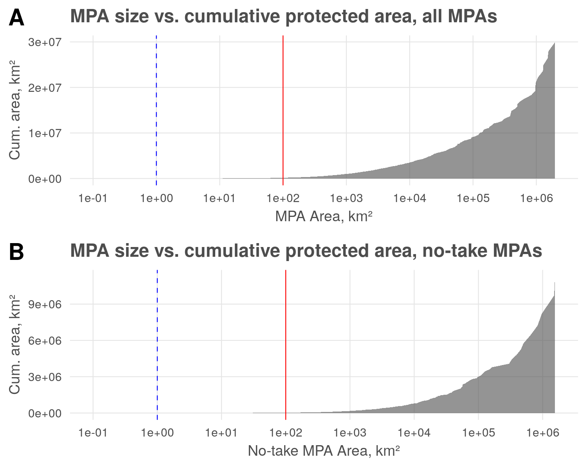

``` {r setup, echo = FALSE, message = FALSE, warning = FALSE}

knitr::opts_chunk$set(fig.width = 6, fig.height = 4, fig.path = 'Figs/',
                      echo = FALSE, message = FALSE, warning = FALSE)

library(raster)
library(sf)
library(fasterize)
library(latex2exp)

source('https://raw.githubusercontent.com/oharac/src/master/R/common.R')  ###

dir_git <- here('../spp_risk_dists')

### goal specific folders and info
dir_spatial <- file.path(dir_git, '_spatial')
dir_o_anx   <- file.path(dir_O, 'git-annex/spp_risk_dists')
dir_wdpa <- file.path(dir_o_anx, 'wdpa')
dir_sa   <- file.path(dir_wdpa, 'sensitivity_analysis')

gp_proj4 <- '+proj=cea +lon_0=0 +lat_ts=45 +x_0=0 +y_0=0 +ellps=WGS84 +units=m +no_defs'

```

### Small MPA coverage as a proportion of global MPA estate

```{r create wdpa marine shapefile}

mpa_poly_file    <- file.path(dir_sa, 'mpa_by_cat_jun2018.shp')
notake_poly_file <- file.path(dir_sa, 'mpa_notake_jun2018.shp')

if(!file.exists(mpa_poly_file)) {

  wdpa_poly_file <- file.path(dir_wdpa, 
                              'wdpa_jun2018/WDPA_June2018-shapefile-polygons.shp')
  wdpa_poly <- sf::read_sf(wdpa_poly_file)

  # wdpa_poly$IUCN_CAT %>% unique()
  iucn_cats <- c('Ia'  = 1,
                 'Ib'  = 1,
                 'II'  = 2,
                 'III' = 3,
                 'IV'  = 4,
                 'V'   = 5,
                 'VI'  = 6)
  
  mpa_poly <- wdpa_poly %>%
    filter(MARINE > 0 | GIS_M_AREA > 0) %>%
    filter(STATUS %in% c('Designated', 'Adopted', 'Established')) %>%
      ### no paper parks!
    filter(!str_detect(tolower(MANG_PLAN), 'non-mpa')) %>%
      ### omit non-MPA fisheries or species management plans!
    mutate(NO_TAKE = ifelse(WDPAID == 309888, TRUE, NO_TAKE),
             ### patch PIPA to be no take - currently "not reported"
           no_take = (NO_TAKE == 'All') | (NO_TAKE == 'Part' & NO_TK_AREA > 0.75 * GIS_M_AREA),
             ### if NO_TK_AREA is 75% or more of GIS area, count it...
           cat = iucn_cats[IUCN_CAT],
           cat = ifelse(no_take & !cat %in% 1:2, -1, cat), ### use -1 as an "other no take" flag
           cat = ifelse(is.na(cat), 8, cat)) %>% ### use 8 as an "other protected" flag
    mutate(area_km2 = st_area(geometry) / 1e6 %>% as.numeric()) %>%
    arrange(area_km2) %>%
    mutate(id  = 1:n()) %>%           ### set a unique number ID for each polygon
    st_transform(crs = gp_proj4) %>%
    select(id, cat, area_km2, NAME, DESIG = DESIG_ENG, IUCN_CAT, 
           MARINE, no_take, stat_yr = STATUS_YR, ISO3,
           geometry) %>%
    clean_df_names()
  
  write_sf(mpa_poly, mpa_poly_file)
  
  ### notake_poly will have different identifiers, and in order of area
  notake_poly <- mpa_poly %>%
    filter(cat <= 2) %>%
    arrange(area_km2) %>%
    mutate(id = 1:n())
  write_sf(notake_poly, notake_poly_file)
  
}
  
```

```{r summarize MPA polys all}

mpa_poly_df <- foreign::read.dbf(str_replace(mpa_poly_file, '.shp', '.dbf')) %>%
  arrange(area_km2) %>%
  mutate(cum_area = cumsum(area_km2))

mpa_poly_small <- mpa_poly_df %>%
  mutate(`MPA size` = case_when(area_km2 < 1 ~ '< 1 km²',
                          area_km2 < 100 ~ '< 100 km²', 
                          area_km2 < 1000 ~ '< 1000 km²', 
                          TRUE ~ '>= 1000 km²')) %>%
  group_by(`MPA size`) %>%
  summarize(`A total, km²` = sum(area_km2) %>% round(1),
            N = n()) %>%
  mutate(`% MPA by count` = (N / sum(N) * 100) %>% round(2),
         `% MPA by area` = (`A total, km²` / sum(`A total, km²`) * 100) %>% round(4))

write_csv(mpa_poly_small, 'tableSM1_mpa_small.csv')

```

``` {r summarize mpas no take}

marine_notake_df <- mpa_poly_df %>%
  filter(cat <= 2) %>%
  arrange(area_km2) %>%
  mutate(cum_area = cumsum(area_km2))

marine_notake_small <- marine_notake_df %>%
  mutate(`MPA size` = case_when(area_km2 < 1 ~ '< 1 km²',
                          area_km2 < 100 ~ '< 100 km²', 
                          area_km2 < 1000 ~ '< 1000 km²', 
                          TRUE ~ '>= 1000 km²')) %>%
  group_by(`MPA size`) %>%
  summarize(`A total, km²` = sum(area_km2) %>% round(1),
            N = n()) %>%
  mutate(`% MPA by count` = (N / sum(N) * 100) %>% round(2),
         `% MPA by area` = (`A total, km²` / sum(`A total, km²`) * 100) %>% round(4))

write_csv(marine_notake_small, 'tableSM2_notake_small.csv')
```

```{r plot area density}

dens_plot1_all <- ggplot(x <- mpa_poly_df,
       aes(x = area_km2)) +
  ggtheme_plot() +
  geom_density(fill = 'grey30', color = NA, alpha = .6) +
  geom_vline(xintercept = 100, color = 'red', size = .25) +
  geom_vline(xintercept = 1, color = 'blue', linetype = 'dashed', size = .25) +
  scale_x_log10(limits = c(.001, NA), breaks = 10^(-3:6)) +
  labs(x = 'MPA Area, km²',
       title = 'Distribution of MPAs by size')

dens_plot1_no_take <- ggplot(x <- marine_notake_df,
       aes(x = area_km2)) +
  ggtheme_plot() +
  geom_density(fill = 'grey30', color = NA, alpha = .6) +
  geom_vline(xintercept = 100, color = 'red', size = .25) +
  geom_vline(xintercept = 1, color = 'blue', linetype = 'dashed', size = .25) +
  scale_x_log10(limits = c(.001, NA), breaks = 10^(-3:6)) +
  labs(x = 'No-take MPA Area, km²',
       title = 'Distribution of no-take MPAs by size')

dens_plot1 <- cowplot::plot_grid(dens_plot1_all, dens_plot1_no_take, 
                                 labels = c('A', 'B'), nrow = 2)

ggsave(plot = dens_plot1, filename = 'sm1_area_density.png', 
       height = 4, width = 5, dpi = 300)

```

```{r plot cum area}

plot1_all <- ggplot(x <- mpa_poly_df %>% 
         filter(id %% 10 == 0 | id > 17800), 
           ### thin the data set a bit to see if those lines go away... doesn't affect cum sum
       aes(x = area_km2, y = cum_area)) +
  ggtheme_plot() +
  geom_area(fill = 'grey30', color = NA,  alpha = .6) +
  geom_vline(xintercept = 100, color = 'red', size = .25) +
  geom_vline(xintercept = 1, color = 'blue', linetype = 'dashed', size = .25) +
  scale_x_log10(limits = c(.1, NA), breaks = 10^(-1:6)) +
  labs(x = 'MPA Area, km²',
       y = 'Cum. area, km²',
       title = 'MPA size vs. cumulative protected area, all MPAs')

plot1_no_take <- ggplot(marine_notake_df, aes(x = area_km2, y = cum_area)) +
  ggtheme_plot() +
  geom_area(fill = 'grey30', color = NA, alpha = .6) +
  geom_vline(xintercept = 100, color = 'red', size = .25) +
  geom_vline(xintercept = 1, color = 'blue', linetype = 'dashed', size = .25) +
  scale_x_log10(limits = c(0.1, NA), breaks = 10^(-1:6)) +
  labs(x = 'No-take MPA Area, km²',
       y = 'Cum. area, km²',
       title = 'MPA size vs. cumulative protected area, no-take MPAs')

plot1 <- cowplot::plot_grid(plot1_all, plot1_no_take, 
                            labels = c('A', 'B'), nrow = 2)

ggsave(plot = plot1, filename = 'sm2_cum_area.png', 
       height = 4, width = 5, dpi = 300)

```






`r knitr::kable(mpa_poly_small, caption = 'Table SM1: All protected areas')`

`r knitr::kable(marine_notake_small, caption = 'Table SM2: No-take protection only')`

### Effect of rasterization on inclusion of small MPAs

``` {r create_nonoverlapping_poly_set}

notake_no_intsx_poly_file <- file.path(dir_sa, 'mpa_notake_no_intsx_jun2018.shp')

if(!file.exists(notake_no_intsx_poly_file)) {
  notake_poly <- read_sf(notake_poly_file)
  
  notake_intsx <- st_intersects(notake_poly) %>%
    lapply(as.integer) ### ditch the sgbp class 
  
  intsx_drop <- data.frame(id = 1:length(notake_intsx)) %>%
    mutate(intsx = notake_intsx) %>%
    unnest(intsx) %>%
    filter(intsx > id) %>%
    .$intsx %>% unique()
  ### 468 unique polygons that overlap smaller polygons.
    
  notake_no_intsx <- notake_poly %>%
    filter(!id %in% intsx_drop)
  ### 2862 polygons with no intersections:
  # check <- st_intersects(notake_no_intsx) %>%
  #   sapply(length) %>% all(. == 1)
  write_sf(notake_no_intsx, notake_no_intsx_poly_file)
}
```

``` {r create notake no intersect raster at different res }

notake_1km_file <- file.path(dir_sa, 'notake_no_intsx_rast_by_id.tif')
notake_500m_file <- file.path(dir_sa, 'notake_no_intsx_rast_by_id_500m.tif')
notake_2km_file <- file.path(dir_sa, 'notake_no_intsx_rast_by_id_2km.tif')
notake_3km_file <- file.path(dir_sa, 'notake_no_intsx_rast_by_id_3km.tif')
notake_5km_file <- file.path(dir_sa, 'notake_no_intsx_rast_by_id_5km.tif')

if(!file.exists(notake_1km_file)) {

  notake_no_intsx <- read_sf(notake_no_intsx_poly_file)
  
  ocean_1km_file  <- file.path(dir_o_anx, 'spatial', 'ocean_1km.tif')

  rast_ocean_1km  <- raster(ocean_1km_file)

  ### rasterize notake areas to 1 km global raster
  notake_rast_1km <- fasterize(sf = notake_no_intsx, 
                               raster = rast_ocean_1km,
                               field  = 'id', 
                               fun    = 'min')

  ### Save the full rasters
  writeRaster(notake_rast_1km, notake_1km_file, 
              progress = 'text',
              overwrite = TRUE)
}
  
if(!file.exists(notake_500m_file)) {

  notake_no_intsx <- read_sf(notake_no_intsx_poly_file)

  ocean_1km_file  <- file.path(dir_o_anx, 'spatial', 'ocean_1km.tif')
  
  rast_ocean_500m  <- raster(ocean_1km_file) %>%
    raster::disaggregate(fact = 2)
  
  ### rasterize notake areas to 1 km global raster
  notake_rast_500m <- fasterize(sf = notake_no_intsx, 
                               raster = rast_ocean_500m,
                               field  = 'id', 
                               fun    = 'min')

  ### Save the full rasters
  writeRaster(notake_rast_500m, notake_500m_file, 
              progress = 'text',
              overwrite = TRUE)
}
  
if(!file.exists(notake_2km_file)) {

  notake_no_intsx <- read_sf(notake_no_intsx_poly_file)

  ocean_1km_file  <- file.path(dir_o_anx, 'spatial', 'ocean_1km.tif')
  
  rast_ocean_2km  <- raster(ocean_1km_file) %>%
    raster::aggregate(fact = 2)
  
  ### rasterize notake areas to 2 km global raster
  notake_rast_2km <- fasterize(sf = notake_no_intsx, 
                               raster = rast_ocean_2km,
                               field  = 'id', 
                               fun    = 'min')

  ### Save the full rasters
  writeRaster(notake_rast_2km, notake_2km_file, 
              progress = 'text',
              overwrite = TRUE)
}
  
if(!file.exists(notake_3km_file)) {

  notake_no_intsx <- read_sf(notake_no_intsx_poly_file)

  ocean_1km_file  <- file.path(dir_o_anx, 'spatial', 'ocean_1km.tif')
  
  rast_ocean_3km  <- raster(ocean_1km_file) %>%
    raster::aggregate(fact = 3)
  
  ### rasterize notake areas to 3 km global raster
  notake_rast_3km <- fasterize(sf = notake_no_intsx, 
                               raster = rast_ocean_3km,
                               field  = 'id', 
                               fun    = 'min')

  ### Save the full rasters
  writeRaster(notake_rast_3km, notake_3km_file, 
              progress = 'text',
              overwrite = TRUE)
}
  
if(!file.exists(notake_5km_file)) {

  notake_no_intsx <- read_sf(notake_no_intsx_poly_file)

  ocean_1km_file  <- file.path(dir_o_anx, 'spatial', 'ocean_1km.tif')
  
  rast_ocean_5km  <- raster(ocean_1km_file) %>%
    raster::aggregate(fact = 5)
  
  ### rasterize notake areas to 2 km global raster
  notake_rast_5km <- fasterize(sf = notake_no_intsx, 
                               raster = rast_ocean_5km,
                               field  = 'id', 
                               fun    = 'min')

  ### Save the full rasters
  writeRaster(notake_rast_5km, notake_5km_file, 
              progress = 'text',
              overwrite = TRUE)
}

```

```{r create comparison dataframes}

get_rast_areas <- function(rast, km2_per_cell = 1) {
  table(values(rast)) %>%
    data.frame() %>%
    rename(id = Var1, cells = Freq) %>%
    mutate(id = as.integer(as.character(id)),
           rast_km2 = cells * km2_per_cell) ### argh, factors
}

compare_areas <- function(polys, rast_df) {
  df <- polys %>%
    as.data.frame() %>%
    select(id, area_km2) %>%
    left_join(rast_df, by = 'id') %>%
    mutate(rast_km2   = ifelse(is.na(rast_km2), 0, rast_km2),
           diff = area_km2 - rast_km2,
           pct_diff = 100 * diff / area_km2)
}
  
compare_file_1km <- file.path(dir_sa, 'area_compare_1km.csv')
compare_file_500m <- file.path(dir_sa, 'area_compare_500m.csv')
compare_file_2km <- file.path(dir_sa, 'area_compare_2km.csv')
compare_file_3km <- file.path(dir_sa, 'area_compare_3km.csv')
compare_file_5km <- file.path(dir_sa, 'area_compare_5km.csv')

### unlink(compare_file_500m)
if(!file.exists(compare_file_1km)) {
  if(!exists('notake_no_intsx')) notake_no_intsx <- read_sf(notake_no_intsx_poly_file)

  notake_rast_1km <- raster(notake_1km_file)

  rast_areas_df <- get_rast_areas(notake_rast_1km)
  
  ### combine polygon areas from notake_no_intsx with raster areas
  notake_areas_df <- compare_areas(notake_no_intsx, rast_areas_df)
  
  write_csv(notake_areas_df, compare_file_1km)
}

if(!file.exists(compare_file_500m)) {
  if(!exists('notake_no_intsx')) notake_no_intsx <- read_sf(notake_no_intsx_poly_file)

  notake_rast_500m <- raster(notake_500m_file)

  rast_areas_df <- get_rast_areas(notake_rast_500m, km2_per_cell = .25)
  
  ### combine polygon areas from notake_no_intsx with raster areas
  notake_areas_df <- compare_areas(notake_no_intsx, rast_areas_df)
  
  write_csv(notake_areas_df, compare_file_500m)
}

if(!file.exists(compare_file_2km)) {
  if(!exists('notake_no_intsx')) notake_no_intsx <- read_sf(notake_no_intsx_poly_file)

  notake_rast_2km <- raster(notake_2km_file)

  rast_areas_df <- get_rast_areas(notake_rast_2km, km2_per_cell = 4)
  
  ### combine polygon areas from notake_no_intsx with raster areas
  notake_areas_df <- compare_areas(notake_no_intsx, rast_areas_df)
  
  write_csv(notake_areas_df, compare_file_2km)
}

if(!file.exists(compare_file_3km)) {
  if(!exists('notake_no_intsx')) notake_no_intsx <- read_sf(notake_no_intsx_poly_file)

  notake_rast_3km <- raster(notake_3km_file)

  rast_areas_df <- get_rast_areas(notake_rast_3km, km2_per_cell = 9)
  
  ### combine polygon areas from notake_no_intsx with raster areas
  notake_areas_df <- compare_areas(notake_no_intsx, rast_areas_df)
  
  write_csv(notake_areas_df, compare_file_3km)
}

if(!file.exists(compare_file_5km)) {
  
  if(!exists('notake_no_intsx')) notake_no_intsx <- read_sf(notake_no_intsx_poly_file)

  notake_rast_5km <- raster(notake_5km_file)

  rast_areas_df <- get_rast_areas(notake_rast_5km, km2_per_cell = 25)
  
  ### combine polygon areas from notake_no_intsx with raster areas
  notake_areas_df <- compare_areas(notake_no_intsx, rast_areas_df)
  
  write_csv(notake_areas_df, compare_file_5km)
}

notake_areas_1km_df <- read_csv(compare_file_1km) %>%
  mutate(res = '1 km')
notake_areas_2km_df <- read_csv(compare_file_2km) %>%
  mutate(res = '2 km')
notake_areas_3km_df <- read_csv(compare_file_3km) %>%
  mutate(res = '3 km')
notake_areas_5km_df <- read_csv(compare_file_5km) %>%
  mutate(res = '5 km')
notake_areas_500m_df <- read_csv(compare_file_500m) %>%
  mutate(res = '.5 km')

notake_areas_df <- bind_rows(notake_areas_500m_df,
                             notake_areas_1km_df,
                             notake_areas_2km_df,
                             notake_areas_3km_df,
                             notake_areas_5km_df) %>%
  select(-cells) %>%
  mutate(res = fct_inorder(res))

```


```{r create size class df}
id_to_class <- notake_areas_1km_df %>%
  as.data.frame() %>% ### not working with raster::subs()
  mutate(size_class = case_when(area_km2 < .001 ~ '< .001',
                                area_km2 < .01  ~ '< .01',
                                area_km2 < .1   ~ '< .1',
                                area_km2 < 1    ~ '< 1',
                                area_km2 < 3    ~ '< 3',
                                area_km2 < 10   ~ '< 10',
                                area_km2 < 100  ~ '< 100',
                                TRUE            ~ '>= 100'),
         size_class = fct_inorder(size_class),
         size_code  = as.integer(size_class)) %>%
  select(id, size_class, poly_area_km2 = area_km2)

```

``` {r compare differences overall}

d_area_all_df <- notake_areas_df %>%
  left_join(id_to_class, by = 'id') %>%
  group_by(res) %>%
  summarize(poly_area_in_class  = sum(area_km2),
            rast_area = sum(rast_km2),
            pct_abs_diff = (100 * sum(abs(area_km2 - rast_km2)) / poly_area_in_class),
            pct_area_diff = (100 * sum(area_km2 - rast_km2) / poly_area_in_class)) %>%
  mutate(poly_area_in_class = round(poly_area_in_class, 3),
         size_class = 'Total') %>%
  ungroup()

pct_real_diff_all_df <- d_area_all_df %>%
  select(size_class, poly_area_in_class, res, pct_area_diff) %>%
  mutate(res = paste0('Sum error (', res, ')'),
         pct_area_diff = round(pct_area_diff, 3)) %>%
  spread(res, pct_area_diff)

pct_abs_diff_all_df <- d_area_all_df %>%
  select(size_class, poly_area_in_class, res, pct_abs_diff) %>%
  mutate(res = paste0('Sum |error| (', res, ')'),
         pct_abs_diff = round(pct_abs_diff, 3)) %>%
  spread(res, pct_abs_diff)

```

``` {r compare differences by class}

d_area_df <- notake_areas_df %>%
  left_join(id_to_class, by = 'id') %>%
  group_by(size_class, res) %>%
  summarize(n_in_class = n(),
            poly_area_in_class  = sum(area_km2),
            rast_area = sum(rast_km2),
            pct_abs_diff = 100 * sum(abs(area_km2 - rast_km2)) / poly_area_in_class,
            pct_area_diff = 100 * sum(area_km2 - rast_km2) / poly_area_in_class) %>%
  mutate(poly_area_in_class = round(poly_area_in_class, 3)) %>%
  ungroup()

pct_real_diff_df <- d_area_df %>%
  select(size_class, poly_area_in_class, res, pct_area_diff) %>%
  mutate(res = paste0('Sum error (', res, ')'),
         pct_area_diff = round(pct_area_diff, 3)) %>%
  spread(res, pct_area_diff) %>%
  bind_rows(pct_real_diff_all_df) %>%
  rename(`Size class, km²` = size_class,
         `Area in class, km² (polygons)` = poly_area_in_class)

pct_abs_diff_df <- d_area_df %>%
  select(size_class, poly_area_in_class, res, pct_abs_diff) %>%
  mutate(res = paste0('Sum |error| (', res, ')'),
         pct_abs_diff = round(pct_abs_diff, 3)) %>%
  spread(res, pct_abs_diff) %>%
  bind_rows(pct_abs_diff_all_df) %>%
  rename(`Size class, km²` = size_class,
         `Area in class, km² (polygons)` = poly_area_in_class)

write_csv(pct_real_diff_df, 'tableSM3_diff_error.csv')
write_csv(pct_abs_diff_df, 'tableSM4_abs_error.csv')
```

### Proportional error by size class

Proportional error in area calculated as 
$$\sum_{i=1}^N \left(\frac{A_{polygon} - A_{raster}}{A_{polygon}}\right)$$

`r knitr::kable(pct_real_diff_df, caption = 'Table SM3: Proportional total difference in area by size class')`

### Proportional absolute error by size class

Proportional absolute error in area calculated as 
$$\sum_{i=1}^N \left|\frac{A_{polygon} - A_{raster}}{A_{polygon}}\right|$$

`r knitr::kable(pct_abs_diff_df, caption = 'Table SM4: RMS proportional error in area by size class')`

### Number of MPAs dropped due to rasterization

``` {r calc dropped areas}
dropped_areas <- notake_areas_df %>%
  left_join(id_to_class, by = 'id') %>%
  mutate(size_class = fct_inorder(size_class),
         dropped = rast_km2 == 0) 

dropped_all <- dropped_areas %>%
  group_by(res) %>%
  summarize(N = n(),
            n_dropped = sum(dropped),
            area_in_class = sum(area_km2),
            area_dropped  = sum(area_km2 * dropped),
            pct_dropped = (100 * n_dropped / n()),
            pct_area_dropped = (100 * area_dropped / area_in_class),
            `Size class, km²` = 'Total') %>%
  select(`Size class, km²`,
         N,
         `Area in class, km²` = area_in_class,
         res,
         pct_dropped,
         pct_area_dropped)

dropped_by_class <- dropped_areas %>%
  group_by(res, size_class) %>%
  summarize(N = n(),
            n_dropped = sum(dropped),
            area_in_class = sum(area_km2),
            area_dropped  = sum(area_km2 * dropped),
            pct_dropped = (100 * n_dropped / N),
            pct_area_dropped = (100 * area_dropped / area_in_class)) %>%
  ungroup() %>%
  select(`Size class, km²` = size_class,
         N,
         `Area in class, km²` = area_in_class,
         res,
         pct_dropped,
         pct_area_dropped) %>%
  bind_rows(dropped_all) %>%
  mutate(`Size class, km²` = fct_inorder(`Size class, km²`))


dropped_pct_df <- dropped_by_class %>%
  select(-pct_area_dropped) %>%
  mutate(res = paste0('% dropped (', res, ')'),
         pct_dropped = round(pct_dropped, 2)) %>%
  spread(res, pct_dropped)

dropped_area_df <- dropped_by_class %>%
  select(-pct_dropped) %>%
  mutate(res = paste0('% area dropped (', res, ')'),
         pct_area_dropped = round(pct_area_dropped, 4)) %>%
  spread(res, pct_area_dropped)

write_csv(dropped_pct_df, 'tableSM5_pct_dropped.csv')
write_csv(dropped_area_df, 'tableSM6_pct_area_dropped.csv')
```

`r knitr::kable(dropped_pct_df, caption = 'Table SM5: Percent of MPAs dropped by size class')`

`r knitr::kable(dropped_area_df, caption = 'Table SM6: Percent of MPA area dropped by size class')`

## Effect of area calculation at 100 km^2^ cells

``` {r define crosstab functions based on MPA pct script}
### Define crosstab function by chunk
crosstab_chunk <- function(mpa_rast, id_rast, chunk, n_chunks) {
  ### chunk <- 30
  chunk_size <- ceiling(ncol(mpa_rast) / n_chunks)
  left_bound <- (chunk - 1) * chunk_size + 1
  right_bound <- min(left_bound + chunk_size - 1, ncol(mpa_rast))
  
  chunk_ext <- extent(mpa_rast, 1, nrow(mpa_rast), left_bound, right_bound)
  message('Processing ', chunk, ': ', paste0(as.character(round(chunk_ext)), collapse = ', '))
  mpa_chunk <- crop(mpa_rast, chunk_ext)
  id_chunk  <- crop(id_rast, chunk_ext)
  
  mpa_cells <- crosstab(mpa_chunk, id_chunk, 
                         progress = 'text',
                         long = TRUE) %>%
    setNames(c('mpa_category', 'cell_id', 'n_prot')) %>%
    mutate(mpa_category = as.integer(as.character(mpa_category)),
           cell_id      = as.integer(as.character(cell_id)))
      ### mpa_category and cell_id are crosstabbed as factors - first
      ### convert to character (to unfactorize it) then to integer.  Otherwise
      ### you end up with factor index, not actual cell ID or category.
  
  return(mpa_cells)
}

calc_rast_to_10km <- function(mpa_rast, id_rast, 
                              out_file, 
                              n_chunks = 60, mc.cores = 8) {

  start_res <- res(mpa_rast)[1]
  stopifnot(res(id_rast)[1] == start_res)
  
  ### Use the function in an mclapply call
  system.time({
    mpa_cells_list <- parallel::mclapply(1:n_chunks, mc.cores = mc.cores,
      FUN = function(x) crosstab_chunk(mpa_rast, 
                                       id_rast, 
                                       chunk = x, n_chunks))
  })
  
  mpa_cells_df <- bind_rows(mpa_cells_list)
  
  mpa_area_df <- mpa_cells_df %>%
    filter(!is.na(mpa_category)) %>%
    mutate(prot_area_km2 = n_prot * (start_res / 1000) ^2) %>%
    select(mpa_category, cell_id, prot_area_km2) %>%
      ### mpa pct is relative to *ocean* area - not *total cell* area
    group_by(mpa_category, cell_id) %>%
    summarize(prot_area_km2 = sum(prot_area_km2)) %>%
    ungroup()
  
  write_csv(mpa_area_df, out_file)
  return(mpa_area_df)
}
```


```{r}
notake_1km  <- raster(file.path(dir_sa, 'notake_no_intsx_rast_by_id.tif'))
notake_500m <- raster(file.path(dir_sa, 'notake_no_intsx_rast_by_id_500m.tif'))
notake_5km  <- raster(file.path(dir_sa, 'notake_no_intsx_rast_by_id_5km.tif'))

cell_id_500m <- raster(file.path(dir_o_anx, 'spatial/cell_id_500m.tif'))
cell_id_1km <- raster(file.path(dir_o_anx, 'spatial/cell_id_1km.tif'))
cell_id_5km <- raster(file.path(dir_o_anx, 'spatial/cell_id_5km.tif'))

cell_area_file_500m <- file.path(dir_sa, 'notake_area_500m.csv')
cell_area_file_1km <- file.path(dir_sa, 'notake_area_1km.csv')
cell_area_file_5km <- file.path(dir_sa, 'notake_area_5km.csv')

if(!file.exists(cell_area_file_5km)) {
  cell_area_500m_df <- calc_rast_to_10km(notake_5km, cell_id_5km, 
                                         cell_area_file_5km, mc.cores = 15)
}
if(!file.exists(cell_area_file_1km)) {
  cell_area_500m_df <- calc_rast_to_10km(notake_1km, cell_id_1km, 
                                         cell_area_file_1km)
}
if(!file.exists(cell_area_file_500m)) {
  cell_area_500m_df <- calc_rast_to_10km(notake_500m, cell_id_500m, 
                                         cell_area_file_500m)
}


```

```{r}

notake_tot_areas_df <- bind_rows(notake_areas_500m_df,
                             notake_areas_1km_df,
                             notake_areas_5km_df) %>%
  select(-cells) %>%
  mutate(res = fct_inorder(res)) %>%
  group_by(res) %>%
  summarize(area_poly = sum(area_km2),
            area_rast = sum(rast_km2))

area_500m <- read_csv(cell_area_file_500m) %>%
  summarize(area_rast_10km = sum(prot_area_km2),
            res = '.5 km')
area_1km <- read_csv(cell_area_file_1km) %>%
  summarize(area_rast_10km = sum(prot_area_km2),
            res = '1 km')
area_5km <- read_csv(cell_area_file_5km) %>%
  summarize(area_rast_10km = sum(prot_area_km2),
            res = '5 km')
calc_areas <- notake_tot_areas_df %>%
  left_join(bind_rows(area_500m, area_1km, area_5km),
            by = 'res') %>%
  rename(`Original res` = res,
         `A_polygon` = area_poly,
         `A_rast,orig` = area_rast,
         `A_rast,10km` = area_rast_10km)
write_csv(calc_areas, file.path(dir_git, 'sens_analysis/tableSM7_calc_to_10km.csv'))

```

`r knitr::kable(calc_areas, caption = 'Table SM7: Calculated areas at original resolution and 10 km resolution')`